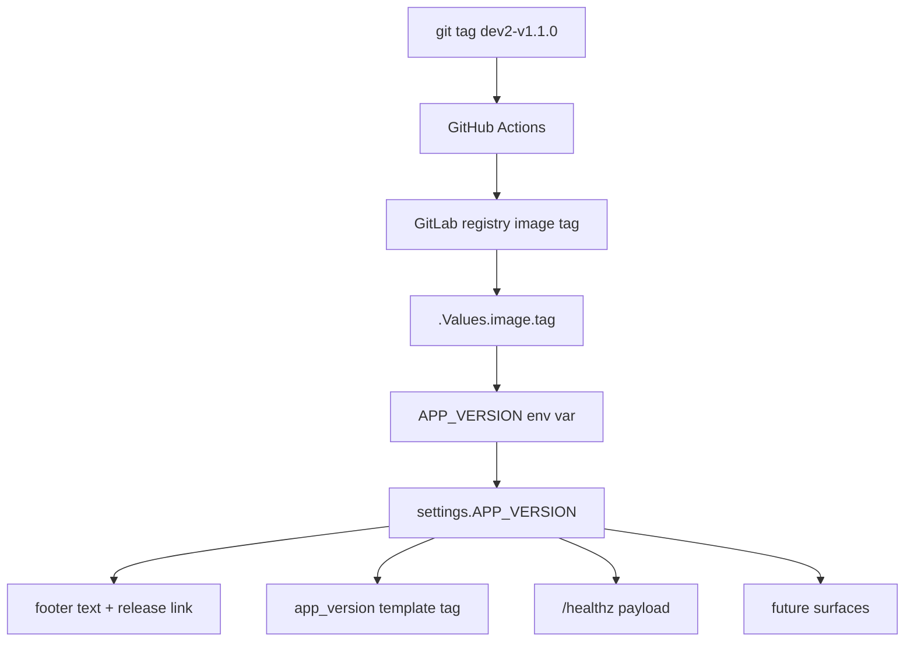

# Version Source of Truth

## Summary

Make the deployed image tag the single value that drives every version surface in the Django app. The Helm chart passes `.Values.image.tag` into the pod as an environment variable, `settings.APP_VERSION` reads it, and the footer, release link, dormant `/healthz` payload, and any future version surface all resolve to that one constant.

## Problem Frame

Tagging a release in git no longer produces a coherent change in what the deployed app says about itself. After `dev2-v1.1.0` was tagged, built, pushed to the registry, and rolled out via the Helm chart, `astrodash-dev.scimma.org` continued to display `v1.0.0` in the footer because `APP_VERSION` is a string literal hard-coded in `app/astrodash_project/settings.py:15`. The same literal — sometimes by reference, sometimes copied — appears in four places: the settings constant, the `app_version` template tag, the footer template's release-page link, and the `get_health_status()` payload in `app/astrodash/core/monitoring.py:75`. Every release will reproduce this bug unless the version stops living in source.

The deploy machinery already does most of the work needed to fix this. The GitHub Actions workflow extracts the git tag and tags the image with it (`.github/workflows/docker_image_workflow.yml:28-34`). The Helm chart names that image tag explicitly per environment (`values-dev.yaml`, `values-prod.yaml`). The pod already receives a ConfigMap as `envFrom`. The only missing link is propagating the image tag into the pod as an env var the Django app reads.

## Key Decisions

- **Chart-derived over build-baked.** The chosen mechanism is Approach A: the chart templates an `APP_VERSION` env var on the web container whose value is `.Values.image.tag`, and `settings.APP_VERSION` reads it via `os.getenv`. Baking the version into the image via a Dockerfile `ARG` (Approach B) is a cleaner SSoT in the abstract, but in this topology the chart's `image.tag` is the only thing that determines what runs, and the chart edit is already the gating action for any deploy. Approach A reuses the existing ConfigMap/envFrom pattern (used today for `DJANGO_DEBUG`, `DB_HOST`, `SECRET_KEY`, etc.), requires no Dockerfile or CI changes, and is symmetric across all four version surfaces.

- **Display the chart tag verbatim, drop the `v` prefix from the template tag.** The footer renders `image.tag` exactly as written in the chart and links to `https://github.com/scimma/astrodash/releases/tag/<image.tag>` — so `dev2-v1.1.0` displays as `dev2-v1.1.0` and links to a release page that exists. No parse rule strips environment prefixes; no synthesis manufactures a semver substring. This means the current `` invocation drops to `` (or equivalent) so the literal `v` isn't double-prepended to tags that already include `v`.

## Requirements

### Django app

- R1. `app/astrodash_project/settings.py` reads `APP_VERSION` from the environment, falling back to the literal string `local` when the env var is unset or empty. The placeholder is intentionally not a semver shape so a developer who accidentally ships a build without the env var produces a footer that screams "not a release" rather than impersonating one.
- R2. The `app_version` template tag (`app/astrodash/templatetags/astrodash_tags.py`) returns `settings.APP_VERSION` without prepending a `v` (or any other prefix) — the value carried in from the chart is already authoritative, and the chart-side value may itself begin with `v`.
- R3. The footer template (`app/astrodash/templates/astrodash/base_site.html`) renders the version verbatim and links to `https://github.com/scimma/astrodash/releases/tag/<APP_VERSION>` — the link target is the same string that's displayed.
- R4. The `get_health_status()` payload in `app/astrodash/core/monitoring.py` reads `settings.APP_VERSION` instead of holding its own string literal. No view changes are required as part of this work — the function is currently dormant — but the literal is consolidated so the next consumer inherits the SSoT.
- R5. No other Django source file may hold a hard-coded version string. A repo-wide grep for `1\.0\.0` and `__version__` returns no version-bearing matches after this lands.

### Helm chart

- R6. The chart's web-container spec (in `astrodash-k8s-gitops/apps/astrodash/templates/deployment-app.yaml`) sets `APP_VERSION` as an environment variable whose value is templated from `.Values.image.tag`. Whether this routes through the existing ConfigMap or an inline `env:` entry on the container is left to planning; both are acceptable.
- R7. No additional values key is required — the chart derives `APP_VERSION` from `image.tag` directly, so dev and prod values files don't need to track a separate version field.

## Acceptance Examples

- AE1. **Covers R1, R2, R3, R6.** **Given** the chart is deployed with `image.tag: dev2-v1.1.0`, **when** a user loads any page on `astrodash-dev.scimma.org`, **then** the footer shows `// dev2-v1.1.0` and the link target is `https://github.com/scimma/astrodash/releases/tag/dev2-v1.1.0`.
- AE2. **Covers R1, R2, R3, R6.** **Given** the chart is deployed with `image.tag: v1.0.0`, **when** a user loads any page on `astrodash.scimma.org`, **then** the footer shows `// v1.0.0` and the link target is `https://github.com/scimma/astrodash/releases/tag/v1.0.0`.
- AE3. **Covers R1.** **Given** a developer runs the app locally with no `APP_VERSION` set in the environment, **when** they load the footer, **then** the displayed value is `local` — clearly not a release tag, and the release link target reads `https://github.com/scimma/astrodash/releases/tag/local` (a 404 the developer will recognize as the local-dev signal).
- AE4. **Covers R4.** **Given** any environment is deployed, **when** `get_health_status()` is invoked (now or by a future view), **then** the `version` field in its payload equals `settings.APP_VERSION` — the same value the footer shows.

## Scope Boundaries

- **Build-baking the version into the image (Approach B) is deferred.** Either baked or chart-derived would solve the bug; chart-derived is being chosen for the smaller change. If a future need arises (e.g., a local `docker run` workflow where the image must self-describe), Approach B can be layered on by adding a Dockerfile `ARG` and `--build-arg` in CI without disturbing Approach A.
- **Chart-side override on top of a baked-in default (Approach C) is deferred.** Reasonable if override scenarios surface (hotfix relabeling, distinguishing rebuilds of the same code), but unnecessary now.
- **ArgoCD Image Updater or any automation that edits chart values for you is not in scope.** Chart-value edits remain manual today and stay that way through this change. Automating that gesture is its own brainstorm.
- **Tag-naming conventions are not in scope.** The current convention (`v<semver>` for prod, `dev<N>-v<semver>` for dev) is what gets displayed; this brainstorm does not propose changing or normalizing it.
- **Frontend styling of the footer is not in scope.** The footer's existing color, font, and link behavior remain untouched.

## Dependencies / Assumptions

- The CI workflow (`.github/workflows/docker_image_workflow.yml`) already extracts the git tag and produces a registry image tag with that exact name. This work depends on that invariant — if CI ever begins emitting an image tag that differs from the git tag, the displayed version will reflect the image tag, not the git tag.
- Registry tags are treated as immutable by convention: one git tag produces one image tag in the GitLab registry, and that image tag is never re-pushed afterward. Approach A's "what the chart says is running" is only true under this discipline — re-pushing `dev2-v1.1.0` over itself would rotate the pod's code (under dev's `pullPolicy: Always`) without changing the displayed footer string. If immutability can't be enforced in the registry workflow, this becomes a residual failure mode that Approach B (build-baked) would close.
- The deploy gesture is "edit `values-dev.yaml` or `values-prod.yaml` to set `image.tag`, commit, ArgoCD syncs." Whoever performs that edit owns the version string the public sees.
- `.Values.image.tag` is always set when the chart is rendered, because both `values-dev.yaml` and `values-prod.yaml` set it explicitly per environment. Helm 3 does not fail on undefined values — it renders them as empty strings — so the safety net for a missing `image.tag` is R1's `local` fallback at the Django layer, not chart templating. If stronger enforcement is wanted later, a chart-level `required` helper or a CI lint on the values files would catch a missing tag before render.
- Local-development runs (without the Helm chart) read whatever environment they're started in. The R1 fallback exists so missing env vars produce an obvious placeholder rather than a misleading blank or stale literal.

## Outstanding Questions

- Whether `APP_VERSION` flows through the existing ConfigMap (`templates/configmap.yaml`'s `range $key, $value := .Values.config` pattern) or via an inline `env:` entry on the web container in `templates/deployment-app.yaml`. Both fit the chart's conventions; the ConfigMap path requires a `config:` key in `values.yaml`, the inline path requires only the deployment template. Planning picks.
- Whether to emit a startup log line announcing the active `APP_VERSION` for operator visibility in pod logs, and at what log level.
- Test coverage shape — likely a Django settings test asserting `APP_VERSION` reflects the env var when set and the placeholder when unset, plus a template-rendering test. Planning decides the exact files.

## Sources

- `app/astrodash_project/settings.py:15` — current `APP_VERSION = '1.0.0'` literal.
- `app/astrodash/templatetags/astrodash_tags.py:8-10` — the `app_version` template tag implementation.
- `app/astrodash/templates/astrodash/base_site.html:189` — footer rendering and release link.
- `app/astrodash/core/monitoring.py:75` — dormant `/healthz` payload with hard-coded `"version": "1.0.0"`.
- `.github/workflows/docker_image_workflow.yml:28-34` — CI tag extraction logic that produces the registry image tag.
- `astrodash-k8s-gitops/apps/astrodash/templates/deployment-app.yaml` — pod spec, current `envFrom` ConfigMap/Secret pattern.
- `astrodash-k8s-gitops/apps/astrodash/templates/configmap.yaml` — ConfigMap template that ranges over `.Values.config`.
- `astrodash-k8s-gitops/apps/astrodash/values.yaml` — `image.repository` and the `config:` block where DJANGO_DEBUG and friends live.
- `astrodash-k8s-gitops/apps/astrodash/values-dev.yaml:3-5` — `image.tag: dev2-v1.1.0` (current dev).
- `astrodash-k8s-gitops/apps/astrodash/values-prod.yaml:3-5` — `image.tag: v1.0.0` (current prod).
