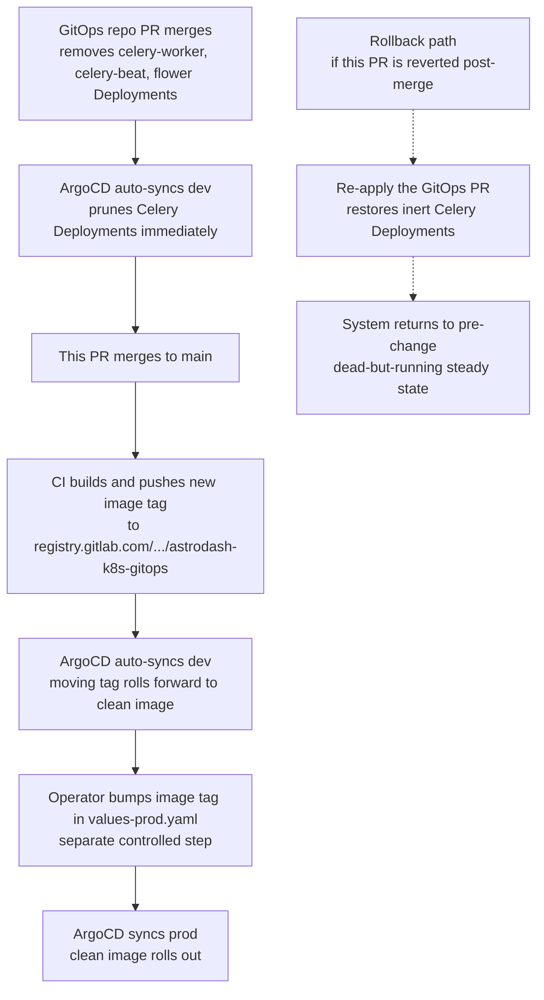

# refactor: Upgrade Django to 5.2 LTS and remove inert Celery infrastructure

## Summary

Upgrade Django from 5.1.14 to the latest 5.2 LTS point release and Python
from 3.11 to 3.13, and delete the currently-inert Celery infrastructure
(dependency, worker / beat / flower services, settings, integration code,
entrypoints, environment variables, and documentation references). Celery
removal commits land before the version bump so the upgrade is verified
against a clean tree. The async batch processing architecture decision
remains deferred to a future brainstorm.

## Problem Frame

The work originates from the brainstorm at
`docs/brainstorms/2026-06-10-django-lts-upgrade-celery-removal-requirements.md`.
Two independent hygiene issues are resolved in one change window: Django
5.1 and Python 3.11 are past their bugfix-support thresholds, and the
Celery wiring carried by the project does no work — there are zero
`@shared_task` / `.delay()` / `.apply_async()` matches in `app/`, and
batch classification runs synchronously via `async_to_sync` at
`app/astrodash/views.py:388-421`. The Celery surface as it stands is
both dead weight and misleading documentation.

The upgrade is proactive — no security advisory or upstream change
forces specific timing.

---

## Key Technical Decisions

- **Django 5.2 LTS over Django 6.0** — satisfies the "fairly recent
  Python" want by enabling Python 3.13 on a single-axis Django minor
  bump while staying on an LTS line through April 2028. Django 6.0
  drops Python 3.10 and 3.11 and puts the project on a non-LTS line
  for roughly twelve months
  (see origin: `docs/brainstorms/2026-06-10-django-lts-upgrade-celery-removal-requirements.md`).
- **Delete inert Celery now; defer the async-architecture choice** —
  retires the misleading "we have async" surface without pre-committing
  Celery vs `django.tasks` vs alternatives. Re-introduction cost is
  bounded: dependency, settings block, three entrypoints, three compose
  services. No data model is affected
  (see origin).
- **Minimal scope on dependency upgrades** — pinned third-party
  dependencies are bumped only as required for compatibility with
  Django 5.2 and Python 3.13. The planner has authority to bump any
  pinned dependency to the version compatibility requires, including
  older pins (`pydantic==2.5.0`, `mozilla-django-oidc==4.0.1`,
  `django-silk==5.4.3`, `psycopg2-binary==2.9.11`) that may need
  substantial jumps for Python 3.13 wheel availability or Django 5.2
  API support (see origin).
- **GitOps repo PR merges first; documented rollback contract** —
  ArgoCD prunes the `celery-worker`, `celery-beat`, and `flower`
  Deployments before this PR ships; the inverse order would leave
  manifests referencing code that no longer exists. The dev cluster
  reconciles immediately on a moving image tag; prod is gated by an
  explicit `values-prod.yaml` tag bump and stays under operator
  control. Rollback is viable only before the prod tag bump in
  `values-prod.yaml`: re-applying the GitOps PR returns prod to the
  pre-removal image (still has Celery code, still dead-but-running).
  After the prod tag bump, the post-removal image no longer carries
  the Celery entrypoints; rollback becomes a no-op and forward fix
  is the only path. Record the pre-removal image tag in the PR
  description so the rollback window has a known-good fallback
  (see origin).
- **Leave orphaned `django_celery_beat_*` and `django_celery_results_*`
  tables in Postgres** — matches the Blast-excision precedent at
  `docs/plans/2026-02-06-refactor-excise-blast-for-standalone-astrodash-plan.md`
  ("Blast tables can be dropped or left in place — Django won't touch
  them"). Removing the apps from `INSTALLED_APPS` is sufficient for
  Django to ignore them. Optional manual cleanup of stale
  `django_migrations`, `auth_permission`, and `django_content_type`
  rows for the two removed apps follows the same precedent. A hard
  table drop, if wanted, is scheduled as a separate hygiene PR after
  one production cycle confirms nothing reads the tables.
- **Sequence Celery-removal commits before the Django / Python upgrade
  commits** — verification of the upgrade runs against a tree with no
  Celery-related code paths, env vars, or services, so any boot or
  smoke regression is attributable to the version bump rather than to
  Celery scaffolding interacting with new Django or Python behavior.

---

## High-Level Technical Design

The cross-repo rollout sequence is the only piece of this work whose
shape isn't local prose. The flow below shows the merge order and
which environment reconciles when.

Directional guidance: dev runs the moving image tag with
`pullPolicy: Always`, so dev sequencing is tighter than prod. Both
clusters auto-sync with `prune: true, selfHeal: true`. No manual
intervention is needed to delete the workloads — ArgoCD reconciles
on its own once the GitOps repo PR merges.

---

## Requirements

Requirements are traced from the origin document. R7a and R7b are
preserved as R7 sub-requirements to match the brainstorm's structure.
One requirement (R9, CHANGELOG) was added during planning; the
origin's verification requirements (brainstorm R9-R12) are renumbered
here as R10-R13 to maintain a continuous sequence.

### Django and Python upgrade

- R1. Django is upgraded from 5.1.14 to the latest available 5.2 LTS
  point release at the time the PR is opened.
- R2. Python is upgraded from 3.11 to 3.13 in `app/Dockerfile` (three
  sites: lines 1, 19, and the hardcoded
  `/usr/local/lib/python3.11/site-packages/` path in the multi-stage
  `COPY --from=deps` at line 27), and in any documentation that
  names the target Python version. The CI workflow at
  `.github/workflows/docker_image_workflow.yml` does not pin a Python
  version and needs no change.
- R3. Pinned third-party dependencies in `app/requirements.txt` are
  bumped only as required for compatibility with Django 5.2 and
  Python 3.13. No speculative upgrades.

### Celery removal

- R4. Celery and Celery-adjacent pinned dependencies are removed from
  `app/requirements.txt`: `flower`, `django-celery-results`,
  `django-celery-beat`. `celery` itself has no explicit pin and is
  pulled in transitively through those three; it drops out of the
  resolved set when they are removed. `watchdog` is removed
  alongside them — it is only consumed by `watchmedo` inside the
  deleted Celery dev entrypoints; no other site in `app/` imports
  it.
- R5. The `celery-worker`, `celery-beat`, and `flower` services are
  removed from `docker/docker-compose.yml`,
  `docker/docker-compose.dev.yaml`, `docker/docker-compose.prod.yaml`,
  and `docker/docker-compose.ci.yaml` (the `ci` file currently does
  not define the services but is verified to still build cleanly).
  The `CELERY_WORKER_LIMIT_CPUS` and `CELERY_WORKER_LIMIT_MEMORY`
  defaults inlined at `docker/docker-compose.yml:81-82` are removed
  with the service block.
- R6. Celery integration code and entrypoints are removed:
  `app/astrodash_project/celery.py`, `app/astrodash_project/k8s.py`,
  `app/entrypoints/docker-entrypoint.celery.sh`,
  `app/entrypoints/docker-entrypoint.celery_beat.sh`,
  `app/entrypoints/docker-entrypoint.flower.sh`, and the `celery_app`
  import and `__all__` export in `app/astrodash_project/__init__.py`.
  The `celery-worker` entry in `COMPOSE_LOG_LIST` at
  `run/astrodashctl:13` is removed.
- R7. The Celery-related `INSTALLED_APPS` entries at lines 63
  (`django_celery_beat`) and 69 (`django_celery_results`) are
  removed. In `app/astrodash_project/settings.py`, the Celery
  configuration is deleted in two non-contiguous ranges:
  lines 170-174 (`CELERY_BEAT_SCHEDULER`, `CELERY_TIMEZONE`,
  `CELERY_IMPORTS`) and lines 187-199 (the broker / result-backend
  block plus `CELERYD_REDIRECT_STDOUTS_LEVEL` at line 199).
  Lines 175-186 are preserved — the `REDIS_SERVICE`, `REDIS_PORT`,
  `REDIS_MASTER_GROUP_NAME`, and `REDIS_OR_SENTINEL` assignments
  at 175-179 back the `CACHES` block at 180-186, which is Django's
  Redis cache backend independent of Celery.
- R7a. Celery-only environment variables are removed from
  `env/.env.default`: `FLOWER_UNAUTHENTICATED_API`, `CELERY_QUEUES`,
  `CELERY_WORKER_LIMIT_CPUS`, `CELERY_WORKER_LIMIT_MEMORY`,
  `MESSAGE_BROKER_PORT`, `FLOWER_PORT`, `MESSAGE_BROKER_HOST`,
  `FLOWER_HOST`, and `DISABLE_CELERY_BEAT`. The `REDIS_*` variables
  remain. `env/.env.ci` and `env/.env.dev` contain no Celery vars
  and need no change.
- R7b. Before merge, confirm `django_celery_beat_periodictask`,
  `django_celery_beat_intervalschedule`, and
  `django_celery_beat_crontabschedule` contain no enabled rows in
  the production and staging databases. The source-grep audit does
  not cover Beat schedules — `DatabaseScheduler` reads them from
  the database. Any enabled rows invalidate the "Celery does no
  work" premise and change scope.

### Documentation

- R8. Documentation no longer states or implies that batch
  classification runs on Celery workers: `README.md` line 30 bullet,
  `docs/admin/updating-data-files.md` lines 276-277 PVC note, and
  `docs/developer/getting-started.md` lines 28-29 profile table.
  Current synchronous behavior is described accurately with a brief
  note that async batch processing is a future roadmap item.
- R9. `CHANGELOG.md` records the upgrade and removal in the
  `[Unreleased]` section: a `Changed` entry for the Django / Python
  bump and a `Removed` entry for the Celery infrastructure.

### Verification

- R10. The existing automated test
  (`app/users/tests/test_user_login.py`) passes under Django 5.2 and
  Python 3.13.
- R11. The application starts cleanly via the `full_dev`, `full_prod`,
  and `ci` profiles in `docker-compose.dev.yaml`,
  `docker-compose.prod.yaml`, and `docker-compose.ci.yaml`, with no
  errors related to removed Celery imports, settings, services, or
  `INSTALLED_APPS` entries. The `slim_*` profile variants share the
  Django code path and are not separately exercised by this smoke
  test (consistent with brainstorm scope).
- R12. Single-spectrum classification works end-to-end via the web UI
  (manual smoke test — automated coverage of this path is absent).
- R13. Synchronous batch classification at
  `app/astrodash/views.py:388-421` continues to produce results for
  a small representative input (manual smoke test).

---

## Implementation Units

### U1. Verify R7b pre-merge gate against production and staging databases

**Goal:** Confirm zero enabled `django_celery_beat` schedule rows in
both databases before any code change is merged. Non-zero counts
invalidate the brainstorm's "Celery does no work" premise and require
scope review.

**Requirements:** R7b.

**Dependencies:** None. Must complete before merging any of U2-U6.

**Files:** None modified. Verification artifact only.

**Approach:** Operator runs three queries against the production and
staging Postgres instances:

- `SELECT count(*) FROM django_celery_beat_periodictask WHERE enabled = true;`
- `SELECT count(*) FROM django_celery_beat_intervalschedule;`
- `SELECT count(*) FROM django_celery_beat_crontabschedule;`

The first must return zero (`enabled = false` rows are tolerated;
they are inert). Counts of zero on the second and third are
informational. If any enabled `periodictask` row exists, halt the
plan and reopen scope.

Record the query output (timestamp, host, count) in the PR description
as the verification artifact.

**Patterns to follow:** The Blast-excision plan at
`docs/plans/2026-02-06-refactor-excise-blast-for-standalone-astrodash-plan.md`
uses direct `DELETE FROM django_celery_beat_periodictask` against
DBs as part of app removal. Adapt to read-only `SELECT` first.

**Test scenarios:**

- Pre-merge SQL on production returns zero enabled `periodictask`
  rows. PR description records the output.
- Pre-merge SQL on staging returns zero enabled `periodictask` rows.
  PR description records the output.

**Verification:** Both databases queried and counts recorded before
U2-U6 merge.

---

### U2. Remove Celery integration from the Django project

**Goal:** Strip Celery wiring from `app/astrodash_project/`. After
this unit, Django boots without any Celery imports, settings, or
`INSTALLED_APPS` entries.

**Requirements:** R6, R7.

**Dependencies:** None (independent of U3-U6 at the code level;
sequenced first by convention).

**Files:**

- `app/astrodash_project/settings.py` — remove the `django_celery_beat`
  entry at line 63 and the `django_celery_results` entry at line 69.
  Delete the Celery configuration in two non-contiguous ranges:
  lines 170-174 and lines 187-199 (including
  `CELERYD_REDIRECT_STDOUTS_LEVEL` at line 199). Preserve lines
  175-186 — the `REDIS_*` block (175-179) and the `CACHES` block
  (180-186) are untouched.
- `app/astrodash_project/celery.py` — delete.
- `app/astrodash_project/k8s.py` — delete (Kubernetes-specific Celery
  bootstep; dormant code, not referenced anywhere).
- `app/astrodash_project/__init__.py` — remove the `from .celery import
  app as celery_app` line and the `__all__ = ("celery_app",)`
  export.

**Approach:** Delete the two `.py` files first, then strip
`__init__.py` so the import error surface is single-step. Settings
edit removes lines 63, 69, 170-174, and 187-199 in one pass,
preserving lines 175-186 and the indentation of surrounding blocks.
Verify inside the built container that `docker run --rm <image>
python -c "import astrodash_project"` exits cleanly with no
module-not-found errors.

**Patterns to follow:** Django app-removal precedent from the
Blast-excision plan: scrub `INSTALLED_APPS`, scrub settings, leave
underlying DB tables alone.

**Test expectation:** none — removal work verified by U7 boot smoke
tests; no new behavior introduced. Django ORM does not reach for the
removed apps' models because they are no longer in `INSTALLED_APPS`.

**Verification:** Run inside the built container — `docker run --rm
<image> python manage.py check` exits zero, and `docker run --rm
<image> python -c "from astrodash_project import settings"` exits
zero with no warnings about missing Celery imports.

---

### U3. Remove Celery from container infrastructure

**Goal:** Delete Celery services, entrypoints, environment variables,
and operator-script references from the container layer. After this
unit, no docker-compose file references Celery, no entrypoint script
launches Celery, and no env file declares Celery-only variables.

**Requirements:** R5, R6 (entrypoint files), R7a.

**Dependencies:** None (independent of U2 at the code level; the
container layer references only deleted entrypoints and removed
services).

**Files:**

- `docker/docker-compose.yml` — remove the `celery-worker` service
  (lines 68-88), `celery-beat` service (lines 90-100), and `flower`
  service (lines 114-123). The `CELERY_WORKER_LIMIT_CPUS` /
  `CELERY_WORKER_LIMIT_MEMORY` defaults at lines 81-82 are removed
  with the service block.
- `docker/docker-compose.dev.yaml` — remove the three `extends:`
  service definitions (lines 56-68, 70-82, 92-104).
- `docker/docker-compose.prod.yaml` — remove the three `extends:`
  service definitions (lines 32-40, 42-50, 60-68).
- `docker/docker-compose.ci.yaml` — verify no Celery service
  definitions remain. No changes expected; included for completeness.
- `app/entrypoints/docker-entrypoint.celery.sh` — delete.
- `app/entrypoints/docker-entrypoint.celery_beat.sh` — delete (note
  the underscore in the filename).
- `app/entrypoints/docker-entrypoint.flower.sh` — delete.
- `env/.env.default` — remove `FLOWER_UNAUTHENTICATED_API` (line 13),
  the `CELERY_*` block (lines 27-29), `MESSAGE_BROKER_PORT` (line 32),
  `FLOWER_PORT` (line 33), `MESSAGE_BROKER_HOST` (line 38),
  `FLOWER_HOST` (line 41), and `DISABLE_CELERY_BEAT` (line 62). Keep
  the `REDIS_*` variables (`REDIS_SERVICE`, `REDIS_PORT`,
  `REDIS_MASTER_GROUP_NAME`).
- `run/astrodashctl` — at line 13, change
  `COMPOSE_LOG_LIST="app celery-worker"` to `COMPOSE_LOG_LIST="app"`.

**Approach:** Delete the three entrypoint shell scripts first; their
removal makes compose-file references to them obviously broken if
any were missed. Then delete the service blocks across all four
compose files in one pass. Then scrub env vars. Then update the
operator script. After this unit, `grep -ri "celery\|flower\|message_broker"`
across `docker/`, `app/entrypoints/`, `env/`, and `run/` returns
empty (matches only in documentation, which U6 handles).

**Patterns to follow:** Per
`docs/developer/getting-started.md:28-29`, `slim_dev` is already a
Celery-free profile, so the `slim_*` profiles need no changes — they
inherit the cleaned base.

**Test expectation:** none — removal work verified by U7 boot smoke
tests; no new behavior introduced.

**Verification:** `docker compose -f docker/docker-compose.yml -f
docker/docker-compose.dev.yaml --profile full_dev config` exits zero
with no warnings about missing services or env vars. `grep -r "celery"
docker/ env/ run/` returns no matches.

---

### U4. Remove Celery Python dependencies from `app/requirements.txt`

**Goal:** Drop Celery and Celery-adjacent pins from the requirements
manifest. After this unit, a fresh `pip install` does not pull Celery,
Flower, django-celery-beat, django-celery-results, or watchdog.

**Requirements:** R4.

**Dependencies:** U4 must follow U2 and U3. Removing pip packages
before removing the import sites produces import errors in any
environment that runs `python manage.py check` outside the
container build pipeline.

**Files:**

- `app/requirements.txt` — remove `django_celery_results==2.6.0`
  (line 12), `django-celery-beat==2.8.1` (line 14), `flower==2.0.1`
  (line 20), and `watchdog==6.0.0` (line 30). There is no explicit
  `celery` pin to delete (celery is transitive through the three
  packages above); verify with `pip show celery` inside the built
  image — "Package not found" is the expected outcome.

**Approach:** One-line deletions; preserve surrounding ordering and
comments. After the edit, re-build the deps stage of the Dockerfile
locally (`docker build --target deps -f app/Dockerfile app/`) to
confirm the dependency graph still resolves cleanly.

**Patterns to follow:** Prior dependency-bump commits in this repo
edit only `requirements.txt` per change (`d70b96f`, `2566549`,
`6749a28`). One commit, one file.

**Test expectation:** none — removal work verified by U7 boot smoke
tests; no new behavior introduced.

**Verification:** `docker build --target deps -f app/Dockerfile app/`
succeeds. `pip show celery flower django-celery-beat
django-celery-results watchdog` inside the built image returns
"Package not found" for each.

---

### U5. Upgrade Django to 5.2 LTS and Python to 3.13

**Goal:** Bump the runtime to Django 5.2 LTS and Python 3.13, and
move any pinned dependency that the bump forces. After this unit,
the application boots on the new stack.

**Requirements:** R1, R2, R3.

**Dependencies:** U2, U3, U4 (verification runs against a tree with
no Celery scaffolding).

**Files:**

- `app/requirements.txt` — change `Django==5.1.14` (line 11) to the
  latest 5.2.x point release at the time the PR is opened. Bump any
  pin that fails Python 3.13 wheel availability or Django 5.2 API
  compatibility during the verification step. Likely candidates,
  to verify during implementation: `pydantic==2.5.0`,
  `pydantic-settings==2.1.0`, `mozilla-django-oidc==4.0.1`,
  `django-silk==5.4.3`, `psycopg2-binary==2.9.11`. Numpy 2.3.0,
  scipy 1.15.3, bokeh 3.7.3 have published cp313 wheels; verify
  during build.
- `app/Dockerfile` — change `python:3.11-slim` to `python:3.13-slim`
  at lines 1 and 19, and change
  `/usr/local/lib/python3.11/site-packages/` to
  `/usr/local/lib/python3.13/site-packages/` at line 27. Verify
  the torch / torchvision install at lines 12-13 — confirm CPU
  wheels exist for the pinned torch version under cp313 before
  committing, using `pip download --no-deps --python-version 3.13
  --only-binary=:all: --platform manylinux_2_28_x86_64 --index-url
  https://download.pytorch.org/whl/cpu torch==2.9.0+cpu
  torchvision==0.24.0`. Record the output in the PR description.
  If the probe fails, bump the torch / torchvision pins to the
  earliest versions that publish cp313 wheels (and update the
  scope-boundary note that this was the minimum forced bump).

**Approach:** Build the new image locally first (`docker build -f
app/Dockerfile -t astrodash:django-5.2-py3.13 app/`); fix wheel
availability or API-deprecation errors by bumping pins in
`requirements.txt`. Re-run `python manage.py check` inside the new
image and resolve any Django 5.2 deprecation warnings that block
boot. Do not silence deprecation warnings to make checks pass —
fix them or bump the offending pin. Settings header comments
referring to Django 3.2 (settings.py:5-10) are not edited; they
are pre-existing staleness outside this plan's scope.

**Patterns to follow:** Prior Django bumps (`d70b96f`, `2566549`,
`6749a28`) modify only `requirements.txt` and (for CVE bumps) the
CHANGELOG. This bump is materially larger because of the Python
interpreter change and likely forced compatibility bumps; the file
list reflects that.

**Test scenarios:**

- The existing automated test
  (`app/users/tests/test_user_login.py`) passes inside the new
  image: `docker run --rm astrodash:django-5.2-py3.13 python
  manage.py test users.tests`.
- `python manage.py check --deploy` inside the new image returns
  no errors (warnings related to existing configuration are
  acceptable; deprecation warnings introduced by the Django 5.2
  bump must be resolved or accepted with rationale).

**Verification:** New image builds. Test in
`app/users/tests/test_user_login.py` passes. Boot smoke covered in
U7.

---

### U6. Update README, admin docs, developer docs, and CHANGELOG

**Goal:** Bring user-facing documentation in line with the new
runtime and the absence of Celery. After this unit, no documentation
states or implies that batch classification runs on Celery.

**Requirements:** R8, R9.

**Dependencies:** U5 (so the documented Python version matches what
shipped).

**Files:**

- `README.md` — line 30 bullet describing "Async processing — Celery
  workers with Redis for batch classification tasks": rewrite to
  reflect synchronous batch processing with a one-line note that
  async batch processing is a future roadmap item.
- `docs/admin/updating-data-files.md` — remove lines 276-277 note
  about celery worker / beat pods mounting the data PVC.
- `docs/developer/getting-started.md` — update the profile table at
  lines 28-29: revise the `full_dev` row to remove "including Celery
  workers" (the row's other content stays accurate); revise the
  `slim_dev` row to remove "(no Celery)" since the distinction no
  longer differentiates the profiles.
- `CHANGELOG.md` — under `## [Unreleased]`, add a `Changed` entry
  ("Upgraded Django to 5.2 LTS and Python interpreter from 3.11 to
  3.13") and a `Removed` entry ("Inert Celery infrastructure
  (`celery`, `flower`, `django-celery-beat`, `django-celery-results`,
  `watchdog` dependencies; `celery-worker`, `celery-beat`, `flower`
  Docker Compose services; `CELERY_*` settings block and
  Celery-related `INSTALLED_APPS` entries; entrypoint scripts;
  Celery-only environment variables)"). Note the paired GitOps
  repo PR in the `Removed` entry by name so the cross-repo coupling
  is discoverable from this repo's history.

**Approach:** Documentation-only edits; no behavior change. Run a
final `grep -ri "celery\|flower" README.md docs/` to confirm no
stale mentions remain in scope (matches in `docs/brainstorms/` and
`docs/plans/` are historical and are left untouched).

**Patterns to follow:** Keep a Changelog format (categorical
entries under `[Unreleased]`). Prior Celery-adjacent prose
removals (e.g., Sphinx removal in `CHANGELOG.md:56-57`) are
written as one-line `Removed` entries enumerating the artifacts
gone.

**Test expectation:** none — documentation-only changes; no
behavior introduced.

**Verification:** `grep -ri "celery\|flower" README.md docs/admin/
docs/developer/` returns no matches. CHANGELOG.md renders cleanly
in a Markdown previewer with the new entries under `[Unreleased]`.

---

### U7. Smoke-test the upgrade and removal

**Goal:** Verify that R10, R11, R12, and R13 hold against the
merged tree.

**Requirements:** R10, R11, R12, R13.

**Dependencies:** U2, U3, U4, U5, U6.

**Files:** None modified. Verification artifact only.

**Approach:** Run the smoke matrix against the built image and
record results in the PR description:

1. Automated regression: `docker run --rm astrodash:django-5.2-py3.13
   python manage.py test users.tests` exits zero.
2. Profile boot `full_dev`: `docker compose -f
   docker/docker-compose.yml -f docker/docker-compose.dev.yaml
   --profile full_dev up` reaches the gunicorn ready line with no
   import errors, missing-service warnings, or
   `INSTALLED_APPS`-related complaints.
3. Profile boot `full_prod`: same as above with the `prod` overlay
   and `full_prod` profile.
4. Profile boot `ci`: invoke the ci profile with the test command
   overridden to skip the missing `astrodash.tests` package —
   `docker compose -f docker/docker-compose.yml -f
   docker/docker-compose.ci.yaml --profile ci run --rm app
   coverage run manage.py test --exclude-tag=download users.tests`.
   Exits zero. Fixing the entrypoint default to drop the missing
   `astrodash.tests` reference is out of scope per Scope Boundaries.
5. Single-spectrum classification: upload a representative spectrum
   via the web UI; confirm a classification is returned and rendered.
6. Synchronous batch classification: submit a small representative
   batch via the web UI; confirm results are returned (the path at
   `app/astrodash/views.py:388-421` continues to function).

**Test scenarios:**

- Covers R10. Existing user-login test passes under Django 5.2 +
  Python 3.13.
- Covers R11. `full_dev`, `full_prod`, and `ci` profiles boot
  cleanly with no Celery-related errors.
- Covers R12. Single-spectrum classification produces a result
  end-to-end via the web UI.
- Covers R13. Synchronous batch classification produces results for
  a representative input.

**Verification:** All six smoke results recorded in the PR
description.

---

## Scope Boundaries

### In scope

Upgrade Django 5.1.14 → 5.2 LTS, upgrade Python 3.11 → 3.13, remove
inert Celery infrastructure end-to-end (dependency, services, code,
entrypoints, env vars, run-script references, documentation), update
CHANGELOG, manual smoke verification. Compatibility-required pin
bumps are in scope.

### Deferred to Follow-Up Work

- **Hard-drop of orphaned `django_celery_*` tables.** Schedule a
  separate hygiene PR after one production cycle confirms nothing
  reads the tables.
- **Optional manual cleanup of `django_migrations`,
  `auth_permission`, and `django_content_type` rows** for the two
  removed apps. Operator can run as part of normal DB hygiene; no
  code change required.

### Outside this plan

- **Async batch processing architecture.** Deferred to a separate
  brainstorm and plan, triggered when batch-async work has concrete
  requirements (throughput targets, failure semantics, monitoring
  needs).
- **Broader dependency sweep.** Major-version upgrades of Bokeh,
  NumPy, SciPy, Pydantic, PyTorch, or any other dependency are out
  of scope unless required for Django 5.2 / Python 3.13
  compatibility.
- **Django 6.0 and Python 3.14.** Revisit after the Django 6.x line
  publishes an LTS (likely Django 6.2 LTS in April 2027) and after
  async-architecture work has resolved.
- **Test suite improvements.** The CI entrypoint at
  `app/entrypoints/docker-entrypoint.app.sh:51` and the test runner
  at `run/astrodash.test.sh:15` reference an `astrodash.tests`
  package that does not exist in the codebase. Known gap; separate
  work.
- **Stale `docs` profile in `run/astrodashctl`** (references
  `docker-compose.docs.yaml`, removed during the Sphinx excision).
  Pre-existing; separate cleanup.
- **Settings.py header comments referring to Django 3.2 docs**
  (`app/astrodash_project/settings.py:5-10`). Pre-existing; separate
  cleanup.
- **IAM, ecosystem integration, and model library curation.** Active
  strategy tracks per `STRATEGY.md`, but not part of this upgrade.

---

## Risks & Dependencies

- **PyTorch CPU wheel availability for cp313 is the most likely
  forced upgrade.** `torch==2.9.0+cpu` and `torchvision==0.24.0` are
  installed in `app/Dockerfile` (not via `requirements.txt`) from
  `https://download.pytorch.org/whl/cpu`. U5 carries the concrete
  probe (`pip download --no-deps --python-version 3.13
  --only-binary=:all: --platform manylinux_2_28_x86_64 --index-url
  https://download.pytorch.org/whl/cpu torch==2.9.0+cpu
  torchvision==0.24.0`) — record its output in the PR description.
  If unavailable, U5 bumps torch / torchvision to the earliest
  versions that publish cp313 wheels.
- **Cross-repo rollback is novel and time-bounded.** The repo has no
  prior precedent for a paired GitOps-first / code-second rollout.
  The rollback contract is viable only before the prod tag bump in
  `values-prod.yaml`: until that bump, re-applying the GitOps PR
  returns prod to the pre-removal image and restores the inert
  Celery Deployments. After the bump, the post-removal image no
  longer ships the Celery entrypoints or binary, and re-applying
  the GitOps PR would land pods in CrashLoopBackOff against the
  current image. Record the pre-removal image tag and the rollback
  drill in the PR description so the operator has a known-good
  fallback during the rollback window.
- **Automated regression coverage is essentially absent.** The only
  automated test is `app/users/tests/test_user_login.py`. R12 and
  R13 are covered by manual smoke tests only. A Django + Python
  major-version upgrade carries non-trivial regression risk on
  these untested paths; manual smoke is the de facto acceptance
  gate, not defense-in-depth. Adding automated coverage is out of
  scope but is a known risk carried by this PR.
- **Dev vs. prod cadence differs.** Dev runs the moving image tag
  with `pullPolicy: Always`; the GitOps PR removing Celery
  Deployments takes effect immediately on dev. Prod is gated by an
  explicit `values-prod.yaml` tag bump and is a separate controlled
  step. Plan the prod tag bump as a deliberate post-merge action,
  not coupled to the code PR merge moment.
- **External dependency: GitOps repo PR merges first.** Code PR
  cannot ship before the paired PR in `astrodash-k8s-gitops` merges
  and ArgoCD prunes the Deployments. Track the GitOps PR URL in
  the code PR description; do not merge the code PR until the
  GitOps PR is merged and reconciled.
- **Redis remains in scope.** Only Celery's use of Redis (broker
  and result backend) is removed. The Django cache backend
  (`django.core.cache.backends.redis.RedisCache` at
  `app/astrodash_project/settings.py:180-186`), the `redis` compose
  service, and the `REDIS_*` env vars all stay.

---

## Sources / Research

- **Origin brainstorm:**
  `docs/brainstorms/2026-06-10-django-lts-upgrade-celery-removal-requirements.md`.
- **Blast-excision precedent (orphan-table convention):**
  `docs/plans/2026-02-06-refactor-excise-blast-for-standalone-astrodash-plan.md`,
  "Database Migration Notes" section. Convention: leave underlying
  tables in place; optional manual cleanup of `django_migrations`,
  `auth_permission`, `django_content_type` rows for the removed
  apps.
- **Multi-environment GitOps cadence:**
  `docs/plans/2026-03-18-001-feat-multi-environment-gitops-plan.md`
  and `docs/brainstorms/2026-03-18-multi-environment-gitops-brainstorm.md`.
  Dev uses moving image tag (`pullPolicy: Always`); prod runs stable
  tag gated by `values-prod.yaml` bump. Both clusters auto-sync with
  `prune: true, selfHeal: true`.
- **Docker image-size precedent (interpreter-path gotcha):**
  `docs/plans/2026-03-16-002-feat-reduce-docker-image-size-plan.md`.
  Establishes the multi-stage layout with the hardcoded
  `/usr/local/lib/python3.11/site-packages/` path that R2 targets.
- **Current Celery wiring sites** (for the implementer's quick
  reference): `app/astrodash_project/celery.py`,
  `app/astrodash_project/k8s.py`,
  `app/astrodash_project/__init__.py:6,8`,
  `app/astrodash_project/settings.py:63,69,170-199`,
  `app/entrypoints/docker-entrypoint.celery.sh`,
  `app/entrypoints/docker-entrypoint.celery_beat.sh`,
  `app/entrypoints/docker-entrypoint.flower.sh`,
  `run/astrodashctl:13`, `env/.env.default:13,27-29,32,33,38,41,62`.
  Zero `@shared_task` / `@app.task` / `.delay(` / `.apply_async(`
  matches anywhere in `app/`.
- **Current synchronous batch path:**
  `app/astrodash/views.py:388-421` invokes `service.process_batch(...)`
  wrapped in `async_to_sync`, executed in the request thread.
- **Django release schedule.** Django 5.2 LTS released April 2025;
  supported through April 2028. Django 5.1 security support ended
  December 2025. Django 6.0 released December 2025; requires
  Python 3.12+.
- **Python support matrix.** Django 5.2 supports Python 3.10, 3.11,
  3.12, 3.13. Django 6.0 supports Python 3.12, 3.13. CPython 3.13
  released October 2024 — bugfix support through October 2026,
  security support through October 2029.
