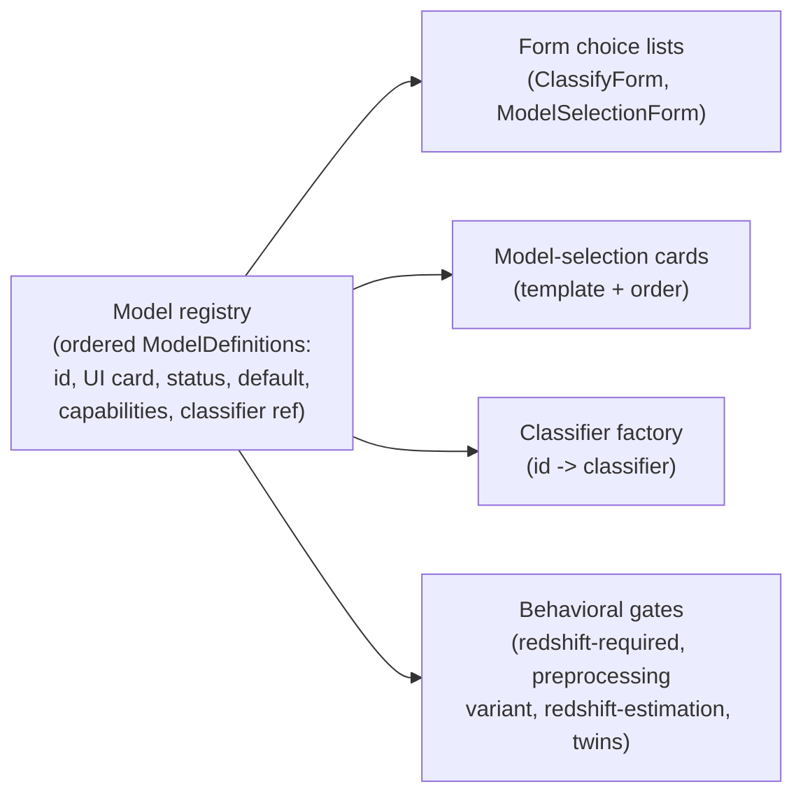

# Classifier Model Registry - Plan

## Goal Capsule

- **Objective:** Position the classifier code so that removing a built-in model is a one-definition edit (a status flip) and adding one is localized to a new definition plus its classifier and its `config/settings.py` fields, while leaving current behavior unchanged. DASH and Transformer remain the two active models at the end of this effort.
- **Product authority:** Scott Koranda (maintainer).
- **Execution profile:** Characterization-tests-first, behavior-preserving refactor. U1 pins current behavior and must stay green through every later unit; the refactor is done when the app behaves identically with the registry underneath.
- **Stop conditions:** Any observed behavior change that the characterization tests do not catch, or any pressure to absorb `config/settings.py` or re-enable the upload cards, is out of scope — stop and surface it rather than expanding the refactor.
- **Tail ownership:** Work lands in this repo (`astrodash`); no `astrodash-k8s-gitops` change. Branch and PR against `origin` per the repo Git workflow.
- **Open blockers:** None block this refactor. Which model eventually replaces Transformer (DAEP vs BERTIE) is deferred to the later add step and does not affect this work.

## Product Contract

### Summary

Introduce a single declarative registry of built-in classifier models. Each model is described once — identity, UI card, lifecycle status, default flag, capability/requirement flags, and the classifier that runs it — and every place that currently hardcodes `dash`/`transformer` reads from that description instead. This is a behavior-preserving enabling refactor: at the end, DASH and Transformer are still the two active models and the app behaves identically, but a later PR can add DAEP/BERTIE (one new definition) or retire Transformer (flip a status) without touching forms, templates, the factory, or the behavioral gates.

### Problem Frame

Adding or removing a classifier today means editing the same model identity in roughly five unrelated places, and getting all of them consistent by hand:

- Two hardcoded choice lists in `app/astrodash/forms.py` (`ClassifyForm.MODEL_CHOICES` and `ModelSelectionForm.model_type`).
- Per-model cards written by hand in `app/astrodash/templates/astrodash/model_selection.html`, with matching per-model CSS and `selectModel(...)` JavaScript.
- An `if/elif` dispatch in `app/astrodash/infrastructure/ml/model_factory.py`.
- Per-model paths and hyperparameters in `app/astrodash/config/settings.py`.
- Scattered behavioral branches that a class-only registry would not fix: `forms.py` `clean()` hardcodes "Transformer requires redshift"; `spectrum_processing_service.py` branches preprocessing on `dash` vs `transformer`; `redshift_service.py` runs only for `dash`; and FIND TWINS is gated to `dash`.

That is 37 `dash`/`transformer` literal hits across 13 non-test files. The immediate driver is that Transformer will later be replaced by a new model, and more models are expected, with the model-selection view growing to several panels. Each add or remove currently pays the full coordination cost across all those sites. Making the roster and each model's requirements declarative pays that cost once.

### Key Decisions

- **Rich model definition, not a thin registry.** (session-settled: user-directed — chosen over a thin identity-plus-UI-plus-class registry: capabilities and requirements travel with the model so the scattered `if model_type ==` branches collapse into reads.)
- **Behavior-preserving refactor; no model added or removed now.** (session-settled: user-directed — this effort only prepares the code. Removing Transformer and adding DAEP are separate later steps, independent of each other and of this refactor.)
- **Retire via status flag, not deletion.** (session-settled: user-directed — chosen over hard delete: a retired model leaves the selection surfaces but still resolves its label and class mapping for any lingering reference. Classification results are session state, not a persisted archive, so honoring this is cheap.)
- **Central, plugin-ready registry, not self-registration now.** (session-settled: user-directed — chosen over decentralized self-registering modules: a legible roster for a small curated set, with a later `registry.add(...)` runway when models arrive independently.)
- **Built-in registry now; unify the upload path later.** (session-settled: user-directed — chosen over unifying built-in and user-uploaded models under one contract immediately: the existing upload path keeps working and the definition is shaped not to preclude convergence.)
- **Characterization tests lock parity.** (session-settled: user-directed — pin the current observable behavior of DASH and Transformer before the branches move, so "identical behavior" is checked, not asserted.)

The registry is the source of truth; every model-facing surface derives from it:

### Requirements

**The registry and the model definition**

- R1. A single registry enumerates the built-in classifier models as an ordered collection. DASH and Transformer are each expressed as one definition, and no `dash`/`transformer` string literal defines a model outside the registry (classifier-internal logic and stored `model_type` values excepted).
- R2. Each definition carries: a stable id; UI card fields (title, description, badge, color); lifecycle status (active or retired); a default flag, with exactly one active model marked default; capability and requirement fields covering requires-redshift, preprocessing variant, supports-twins, supports-redshift-estimation, supports-template-overlays, and supports-rlap; and a reference to the classifier that runs it.

**Read sites derive from the registry**

- R3. The model choice lists in both `ClassifyForm` and `ModelSelectionForm` are generated from the registry's active definitions rather than hardcoded.
- R4. The model-selection cards render from the registry (title, description, badge, color, and order), replacing the hand-written per-model card markup. The selected-state styling (border and box-shadow color) is driven from the definition's color field applied inline, so no static per-model CSS rule keyed by `data-model-type` remains in the template.
- R5. The classifier factory resolves a model id to its classifier through the registry, replacing the `if/elif` dispatch. The user-uploaded model path continues to resolve through the same factory entry point.
- R6. The behavioral branches that today compare `model_type` literals read their answer from the definition's capability fields instead. This covers every current gate: redshift-required validation in `forms.clean()` and the separate batch-view redshift check in `ui_views.py`; preprocessing-variant selection in spectrum processing; the redshift-estimation gate; the twins gate; the template-overlay section gate in `ui_views.py`; and the RLAP gate in the batch results formatter.

**Parity (behavior-preserving)**

- R7. At the end of this effort, behavior is identical to today: DASH and Transformer are the active models, Transformer is the default, "Transformer requires redshift" holds, redshift estimation and FIND TWINS remain DASH-only, and every card and label renders as before. No model is added or removed.
- R8. Characterization tests pin the current observable behavior of DASH and Transformer — model selection, the redshift requirement (classify and batch), the preprocessing path, redshift-estimation, twins eligibility, template-overlay eligibility, and RLAP eligibility — and pass unchanged after the refactor.

**Prepared for the deferred work (present but inert)**

- R9. The `status` and `default` fields hold real values for the current models (Transformer default; both active) but drive no change now. A later PR retires Transformer or moves the default by editing one definition.
- R10. Adding a later model is one new definition plus its classifier, and a future upload path can register through the same registry, with no changes required at the read sites in R3-R6.

### Acceptance Examples

- AE1. **Covers R3, R4, R7.** **Given** the registry with DASH and Transformer active, **when** the classify model-selection page renders, **then** exactly the DASH and Transformer cards appear, in today's order, with today's titles, descriptions, and badges.
- AE2. **Covers R6, R7.** **Given** a classify submission selecting Transformer with no redshift, **when** the form validates, **then** it raises the same "Redshift is required for Transformer model" error as today, because the Transformer definition's requires-redshift flag is true.
- AE3. **Covers R6, R7.** **Given** a classify submission selecting DASH with no redshift, **when** the form validates, **then** it passes, because DASH's requires-redshift flag is false.
- AE4. **Covers R6, R7.** **Given** a completed DASH classification, **when** the result view renders, **then** FIND TWINS is available; **given** a completed Transformer classification, **then** it is not — each driven by the supports-twins flag on the respective definition.
- AE5. **Covers R9.** **Given** the Transformer definition marked retired in a test (production keeps it active), **when** the model-selection page renders, **then** no Transformer card appears, **and** a result that references `transformer` still resolves its label and class mapping. This exercises the retirement capability without changing production behavior.

### Success Criteria

- **Parity, verified.** The existing test suite plus the new characterization tests pass unchanged, and there is no user-visible change: cards, labels, the redshift requirement, the default model, and the redshift-estimation and twins gating are all identical to today.
- **Localization, demonstrated.** Retiring a model touches only the registry — one definition (a status flip). Adding a model is localized to a new definition, its classifier, and its `config/settings.py` path and hyperparameter fields, with no edits to forms, templates, the factory, or the behavioral gates. Shown by the AE5 retire-in-a-test scenario and by the absence of model-defining `dash`/`transformer` literals outside the registry, `config/settings.py`, and classifier internals.

### Scope Boundaries

**Deferred for later (the "easy changes" this refactor enables):**

- Actually retiring Transformer, and actually adding DAEP/BERTIE — separate, independent later steps.
- The public "contribute a model" upload interface and model-vs-model comparison / benchmarking.

**Outside this work's identity:**

- The twins/embedding axis (DAEP as an embedding model) — that is the separate FIND TWINS brainstorm, not this classifier-registry work.
- A data-driven or DB-backed registry. The registry stays code-native now; self-registration for independently contributed models is a later runway, deliberately not built here.
- Absorbing per-model configuration from `config/settings.py`. Model weight paths and hyperparameters stay in the pydantic settings, so adding a model also adds its `config/settings.py` fields; only retire/remove is a pure one-definition edit.

### Outstanding Questions

**Deferred to planning:**

- The exact capability-field set and names. The four fields in R2 are the floor for the two current models; fields a future model needs (e.g. DAEP-specific preprocessing) are added when that model lands.
- Whether a definition's classifier reference is a class, an import path, or a factory callable — an implementation choice for planning.

**Deferred to the later add/remove steps (recorded, not blocking):**

- Which model becomes the default when Transformer is later retired (DASH or the new arrival).
- Whether DAEP or BERTIE is the model that replaces Transformer in this classify view. The registry design is identical either way; this only names the later add task.

### Sources / Research

- `app/astrodash/forms.py` — `ClassifyForm.MODEL_CHOICES`, `ModelSelectionForm.model_type` choices, and the `clean()` Transformer-requires-redshift branch.
- `app/astrodash/templates/astrodash/model_selection.html` — hand-written per-model cards, per-model CSS, and the `selectModel(...)` JavaScript.
- `app/astrodash/infrastructure/ml/model_factory.py` — the `if/elif` `model_type` dispatch to classifier classes.
- `app/astrodash/infrastructure/ml/classifiers/base.py` — the `BaseClassifier` interface the registry's classifier reference points at.
- `app/astrodash/domain/services/spectrum_processing_service.py` — the `dash` vs `transformer` preprocessing branch.
- `app/astrodash/domain/services/redshift_service.py` — the DASH-only redshift-estimation gate.
- `app/astrodash/ui_views.py` — the classify flow and the DASH-gated twins embedding stash.
- `app/astrodash/config/settings.py` — per-model paths and hyperparameters (`dash_*`, `transformer_*`).
- `app/astrodash/models.py` — `SpectrumRecord` and `UserModelRecord` are the only persisted records; classification results are session state, which is why retirement only needs the registry to resolve labels, not a results-table migration.

---

## Planning Contract

**Product Contract preservation:** unchanged. Planning discovered that the current `select-model` page renders only DASH and Transformer — the user-model and upload cards are commented out in `model_selection.html:101-146` ("functionality preserved, visuals disabled") — which matches AE1 as written; no requirement was rewritten.

### Key Technical Decisions

- KTD1. **Central declarative registry of rich `ModelDefinition`s.** One module holds an ordered list of definitions; forms, template cards, the factory, and the behavioral gates all read from it. (session-settled: user-directed — chosen over a thin registry and over self-registering plugins now: capabilities travel with the model and the roster stays legible, with `registry.add(...)` as a later runway. Instantiates Product Contract Key Decisions.)
- KTD2. **Behavior-preserving; characterization-tests-first.** U1 pins current behavior before any read site moves and stays green throughout. (session-settled: user-directed — pin parity rather than assert it.)
- KTD3. **Retire via a `status` field, not deletion.** Retired definitions leave the active surfaces but still resolve label/class-mapping. (session-settled: user-directed — chosen over hard delete.)
- KTD4. **Registry enumerates built-in classifiers only (DASH, Transformer).** The user-model/upload cards stay commented out and their form/view machinery is untouched; the `user_model_id` path keeps its existing pre-`model_type` branch in the factory. (session-settled: user-approved — confirmed after finding the cards are disabled; strictly parity, and consistent with the deferred upload-unification decision.)
- KTD5. **`config/settings.py` stays out of the registry.** Model weight paths and hyperparameters remain in the pydantic `Settings`; a definition references its classifier, not its file paths. (From the requirements review; keeps the two-settings split intact.)
- KTD6. **A definition references its `BaseClassifier` subclass; the factory instantiates it with `config`.** Mirrors the current `ModelFactory` pattern (`DashClassifier(config)` / `TransformerClassifier(config)`). The `preprocessing` field is a string identifier (`"dash"` / `"transformer"`) consumed by `spectrum_processing_service`; the user-model path keeps its existing pass-through `else` branch (no definition).
- KTD7. **Card presentation fields reproduce the current cards exactly.** The definition's UI fields expand to title, description, color, an ordered feature-tag list, an optional icon, and a `recommended` flag — enough to reproduce DASH's RECOMMENDED badge, flask icon, and tag set and Transformer's tag set without per-model template branches.
- KTD8. **Registry module lives in `infrastructure/ml/`, co-located with `model_factory`.** `ModelDefinition` is a dataclass; the Django form/template/view layers import it (as `ui_views` already imports infrastructure), avoiding an import cycle.

### Assumptions

- "Parity" means the current two-card state (DASH + Transformer), not the intended four-card state. Re-enabling the upload cards is explicitly out of scope.
- `ModelFactory.get_classifier(model_type, user_model_id)` keeps its signature; a non-empty `user_model_id` bypasses the registry exactly as today.

---

## Implementation Units

### U1. Characterization tests locking current behavior

- **Goal:** Pin every current observable behavior of DASH and Transformer so later units can prove parity.
- **Requirements:** R8 (KTD2).
- **Dependencies:** none.
- **Files:** `app/astrodash/tests/test_classifier_parity.py` (new).
- **Approach:** Pin the `model_type` branch outcomes — the logic this refactor moves — at the cheapest seam that exercises each branch, not the model math. Redshift-required and preprocessing-variant selection are characterized directly at the form and `spectrum_processing_service` level with no model run. The classification-dependent gates (twins, template-overlay, RLAP) are characterized at the view/formatter-helper seam using a constructed classification result with `model_type` set, rather than a live model forward pass — so the tests do not depend on the external weights volume being populated. Also assert the `select-model` page render. These tests must pass on today's code unchanged and stay green through U3-U5.
- **Execution note:** Write these first, before any registry code or read-site change.
- **Patterns to follow:** existing `app/astrodash/tests/test_monitoring.py` and `test_twins_search_service.py`.
- **Test scenarios:**
  - Covers AE1. `GET /astrodash/select-model/?action=classify` renders exactly the DASH and Transformer cards, in current order, with current titles/descriptions/badges; the user-model and upload cards are absent.
  - Covers AE2. `ClassifyForm` with `model=transformer` and no redshift raises "Redshift is required for Transformer model"; the batch path (`ui_views`) raises the same for a Transformer batch with no redshift.
  - Covers AE3. `ClassifyForm` with `model=dash` and no redshift validates.
  - `spectrum_processing_service.prepare_for_model` returns the DASH-shaped result for `dash`, the Transformer-shaped result for `transformer`, and the pass-through result for a user model.
  - `redshift_service` returns its non-DASH error for `transformer` and runs for `dash`.
  - Covers AE4. A constructed DASH classification result makes FIND TWINS available (embedding stashed); a Transformer result does not.
  - Template-overlay eligibility is true for `dash` and false for `transformer` (`show_templates_section`).
  - RLAP is populated for a `dash` batch item and `-` for a `transformer` batch item.
- **Verification:** the full suite is green on current code with these tests present.

### U2. `ModelDefinition` dataclass and the central registry

- **Goal:** Introduce the registry as the single source of truth, with no read-site changes yet.
- **Requirements:** R1, R2, R9, R10 (KTD1, KTD6, KTD7, KTD8). The ordered `MODELS` list plus the lookup helpers are what make R10's "one new definition, registers through the same registry" shape hold without read-site changes.
- **Dependencies:** none (logically after U1).
- **Files:** `app/astrodash/infrastructure/ml/model_registry.py` (new); `app/astrodash/tests/test_model_registry.py` (new).
- **Approach:** Define `ModelDefinition` (id; title, description, color, feature tags, optional icon, recommended flag; `status`; `is_default`; `requires_redshift`, `preprocessing`, `supports_twins`, `supports_redshift_estimation`, `supports_template_overlays`, `supports_rlap`; classifier class reference). Populate the `MODELS` list with DASH and Transformer carrying their current values (Transformer `is_default=True`; DASH `recommended=True`). Provide `get_definition(id)`, `active_definitions()`, and `default_definition()`, plus a module-load invariant that exactly one active definition is default.
- **Test scenarios:**
  - `active_definitions()` returns DASH and Transformer in order; `default_definition()` is Transformer.
  - `get_definition("dash")` exposes `requires_redshift=False`, `supports_twins=True`, `preprocessing="dash"`; Transformer exposes `requires_redshift=True`, `supports_twins=False`.
  - Covers AE5. Marking Transformer `status=retired` drops it from `active_definitions()` while `get_definition("transformer")` still resolves its label/fields.
  - The exactly-one-default invariant raises when violated.
- **Verification:** new unit tests pass; nothing imports the module yet, so U1 stays green unchanged.

### U3. Route the factory and forms through the registry

- **Goal:** Classifier dispatch and both form choice lists derive from the registry.
- **Requirements:** R3, R5 (KTD1, KTD4, KTD6).
- **Dependencies:** U2.
- **Files:** `app/astrodash/infrastructure/ml/model_factory.py`; `app/astrodash/forms.py`; `app/astrodash/tests/test_model_factory.py` (extend or new).
- **Approach:** `get_classifier` resolves the definition by `model_type` and instantiates `definition.classifier(config)`, keeping the `user_model_id` bypass ahead of it. `ClassifyForm` and `ModelSelectionForm` build their built-in choices from `active_definitions()`, appending the preserved `user_uploaded`/`user_model`/`upload` entries exactly as today (the upload machinery is untouched). The default `initial` comes from `default_definition()`.
- **Test scenarios:**
  - `get_classifier("dash")` / `("transformer")` return the right classifier types; an unknown id raises `ModelConfigurationException`; a `user_model_id` still returns `UserClassifier`.
  - Both forms' built-in choices are DASH and Transformer with the preserved upload entries; the default is Transformer.
  - U1 parity tests stay green.
- **Verification:** U1 plus new tests green.

### U4. Route the template cards and per-model CSS through the registry

- **Goal:** Cards render from the registry, with no `data-model-type`-keyed CSS remaining.
- **Requirements:** R4 (KTD1, KTD7).
- **Dependencies:** U2.
- **Files:** `app/astrodash/templates/astrodash/model_selection.html`; `app/astrodash/ui_views.py` (pass definitions into the context); `app/astrodash/tests/test_classifier_parity.py` (extend).
- **Approach:** The `model_selection` view passes `active_definitions()` to the template, which loops to render each card (title, description, color, feature tags, icon, recommended badge, order). Each card carries its color as a data attribute; `selectModel()` applies that color to the border and box-shadow on selection and clears it on deselection, preserving the transparent-until-selected behavior while removing the static `.model-card.selected[data-model-type="dash"|"transformer"]` rules. The commented-out upload/user-model cards stay commented (KTD4).
- **Execution note:** Card markup parity is exact — same tags, icon, RECOMMENDED badge, and order as today.
- **Test scenarios:**
  - Covers AE1. The rendered page has DASH and Transformer cards with identical titles, descriptions, feature tags, DASH's RECOMMENDED badge and icon, and order; the upload cards remain absent.
  - No CSS rule keyed by `data-model-type` remains in the template.
  - U1 parity tests stay green.
- **Verification:** U1 parity tests green; manual visual check of the rendered page.

### U5. Route the behavioral gates through capability fields

- **Goal:** Every `model_type` literal branch reads a capability field from the definition.
- **Requirements:** R6, R7 (KTD1, KTD6).
- **Dependencies:** U2.
- **Files:** `app/astrodash/forms.py`; `app/astrodash/ui_views.py`; `app/astrodash/domain/services/spectrum_processing_service.py`; `app/astrodash/domain/services/redshift_service.py`; `app/astrodash/tests/test_classifier_parity.py` (extend).
- **Approach:** At each site, resolve the definition (`get_definition(model_type)`) and read the capability: `requires_redshift` (form `clean()` and the batch redshift check in `ui_views.py:772`), `preprocessing` (`spectrum_processing_service` variant selection), `supports_redshift_estimation` (`redshift_service`), `supports_twins` (the twins-embedding stash, `ui_views.py:638-644`), `supports_template_overlays` (`ui_views.py:635`), and `supports_rlap` (batch formatter, `ui_views.py:868`). The `preprocessing` variant identifier keeps its string comparison in `spectrum_processing_service` per KTD6 — it selects a processor, it does not define a model. When no definition resolves (a `user_model_id` or `user_uploaded`), preserve today's non-DASH/non-Transformer fallback behavior.
- **Test scenarios:**
  - Covers AE2, AE3. Redshift-required holds for Transformer (classify and batch) and not for DASH, driven by `requires_redshift`.
  - Covers AE4. Twins eligibility, template-overlay eligibility, and RLAP follow `supports_twins` / `supports_template_overlays` / `supports_rlap`.
  - The preprocessing path matches per model; the user-model pass-through path is unchanged.
  - A guard test asserts no `dash`/`transformer` model-defining literal remains outside `model_registry.py`, classifier internals, and the `preprocessing`-variant comparison in `spectrum_processing_service` (a processor-selection identifier per KTD6, not a model-defining literal) — mirroring the `test_no_version_literals.py` precedent.
  - U1 parity tests stay green.
- **Verification:** U1 plus new tests green; the guard test passes.

---

## Verification Contract

- **Full suite:** `run/astrodash.test.sh slim_dev` — runs `astrodash.tests` and `users.tests` with coverage inside the container. Must be green, including the new characterization, registry, factory, and guard tests.
- **Single module while iterating:** `docker compose <compose args> exec app_dev python manage.py test astrodash.tests.test_classifier_parity -v 2` (compose args from `run/get_compose_args.sh slim_dev`).
- **Formatting:** `black` over the changed Python files.
- **Manual parity check:** load `http://localhost:4000/astrodash/select-model/?action=classify` and confirm the page renders identically — DASH (RECOMMENDED) and Transformer cards only, upload cards absent.

---

## Definition of Done

- R1-R10 satisfied: built-in model identity, UI cards, capabilities, and dispatch all derive from `model_registry.py`; no `dash`/`transformer` model-defining literal remains outside the registry, classifier internals, and the `preprocessing`-variant comparison in `spectrum_processing_service`.
- U1 characterization tests pass unchanged before and after the refactor; the full suite plus coverage is green.
- No `data-model-type`-keyed CSS remains; card rendering is visually identical.
- Behavioral gates (redshift-required for classify and batch, preprocessing variant, redshift-estimation, twins, template-overlay, RLAP) are capability-driven; the user-model path is unchanged.
- `config/settings.py` is untouched; the upload/user-model cards remain commented out and their machinery intact.
- `status` and `default` exist on definitions but change no current behavior (Transformer default, nothing retired).
- Changed Python is `black`-formatted.
