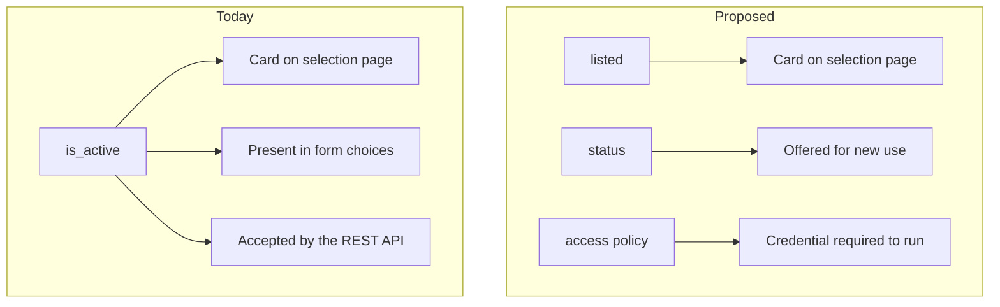
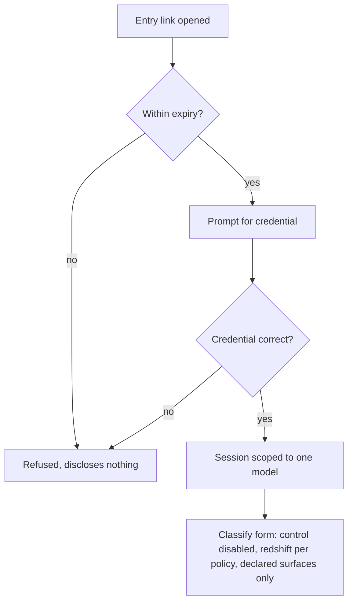
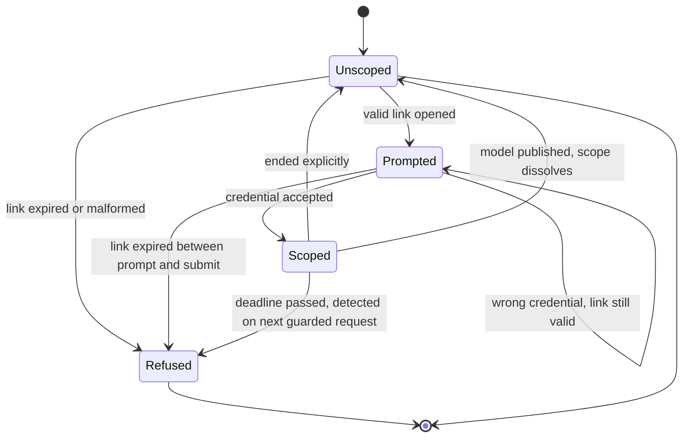
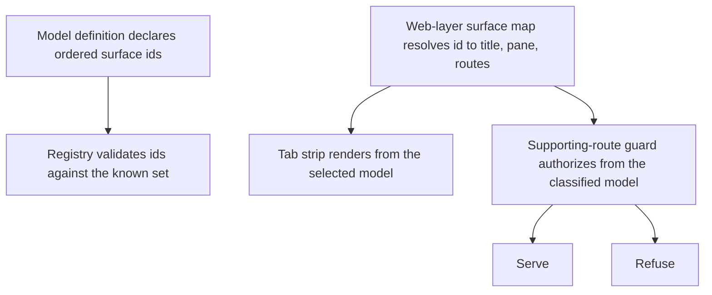

# Registry-Driven Model Surface - Plan

## Goal Capsule

- Objective: let a model definition control its own public surface — whether it is listed on the model-selection page, whether reaching it requires a credential, whether redshift is an input, and which result surfaces it offers.
- Product authority: this plan owns the generic registry capability only. Integrating any specific new classifier is not active scope.
- Authority hierarchy: a requirement wins on product behavior; a Key Technical Decision wins on implementation mechanism within its cited requirements; a unit overrides neither. Acceptance examples and flows illustrate, never amend.
- Execution profile: nine units, dependency-ordered. U1 and U2 are the registry foundation and unblock everything else. The gate (U6, U7, U9) is the riskiest cluster and lands after the registry and surface work is proven.
- Stop conditions: stop and ask if implementation reveals that a requirement cannot hold without changing product behavior, or that the gate cannot be built without a second authentication system — KD10 bounds it to the smallest shape that works.
- Tail ownership: the implementer runs the Verification Contract gates and satisfies the Definition of Done. This plan does not own commits, branches, or deployment.
- Open blockers: none.

**Product Contract preservation:** changed — R26 extended (gated models are also never the registry default), AE6 reworded (the twins guard reads the session's model rather than a model named in the request, which the twins routes do not carry), and R33–R35 added. All four came from plan-time flow analysis and were confirmed before writing.

---

## Product Contract

### Summary

Model definitions gain control over their own public surface. A model can be fully usable while unlisted on the selection page, reachable only through a model-scoped entry link that expires and asks for a shared credential, and landing the visitor in a classification form locked to that one model. Definitions also declare whether redshift is an input at all, and which result surfaces they offer.

### Problem Frame

A model's presence in the registry currently implies its full public exposure. One boolean, `is_active`, answers three unrelated questions at once: whether a card renders on the selection page (`app/astrodash/ui_views.py:186`), whether the model appears in form choice lists (`app/astrodash/forms.py:15`), and whether the REST API will accept it (`app/astrodash/views.py:98`). A model is either wholly public or wholly unavailable — there is no state in between, and no per-model visibility or access concept exists anywhere in the application.

That becomes a problem when a classifier must be usable before it is public. A model whose describing paper is under peer review needs to work for an assigned reviewer while remaining un-browsable by ordinary users, and the reviewer is anonymous, so any access path that requires an account is unavailable.

Two other per-model traits are similarly stuck. `requires_redshift` distinguishes only required from optional — both render the field — so a model that derives redshift from the spectrum rather than accepting it has no way to say so, and the redshift and Known Redshift controls render unconditionally (`app/astrodash/templates/astrodash/classify.html:91`, `:94`). Result surfaces are worse: `supports_twins` exists but is read in exactly one place (`app/astrodash/ui_views.py:657`), while the DASH Twins tab, its button, and its pane are gated by three hardcoded `selected_model_type == 'dash'` conditionals in the same template (`:30`, `:114`, `:273`) that the literal-guard test cannot see, because it scans four Python files and no templates (`app/astrodash/tests/test_no_model_type_literals.py:37-42`).

### Key Decisions

- KD1. Split listing from usability. Whether a model appears in the picker becomes a property distinct from its lifecycle status and from whether it can run, because requirement R1 is precisely "invisible but working." Governs R1, R2, R3, R4, R26, R27.
- KD2. Gate on the model, not on the page. The credential requirement is a property of the model that every surface consults, rather than a check added page by page, so a surface added later cannot silently omit it. Governs R9.
- KD3. Model-scoped entry link carrying an expiry, plus a shared credential (session-settled: user-approved — chosen over a bare `?model=` query parameter, a signed link used as the sole credential, and ingress basic auth: it keeps the credential convention journal editors already use while adding expiry and preventing enumeration of unlisted models). Governs R5, R6, R7, R8, R10, R28.
- KD4. Result surfaces are a declared, ordered list against a surface registry, not one boolean per tab (session-settled: user-approved — chosen over adding a boolean per surface: a third surface is already anticipated, and booleans require editing per-model conditionals in the template each time). Governs R16, R17, R18, R19, R20, R30, R31.
- KD5. Redshift input policy is a three-way property, kept separate from whether a model estimates redshift. A model can decline redshift as an input and still produce one as an output. Governs R13, R14, R15.
- KD6. This plan owns the generic capability only; integrating any specific classifier is separate work (session-settled: user-directed — chosen over one plan covering capability and classifier integration together, or driving from the integration and generalizing afterward: the capability is buildable and verifiable against DASH, Transformer, and a test-only gated fixture, and stays publishable without reference to any unreleased model). Governs R32.
- KD7. Confidentiality for an unreleased classifier comes from where its commits live, not from loading it at runtime (session-settled: user-directed — chosen over moving model definitions to off-repo runtime configuration: it keeps the registry code-native and removes a data-driven registry from this plan entirely).
- KD8. A gated session reaches classification only (session-settled: user-approved — chosen over admitting batch, or declaring reachable flows per model: it keeps the gated surface as small as the reviewing use case requires). Governs R24.
- KD9. The REST API refuses gated models outright rather than accepting a credential (session-settled: user-approved — chosen over credentialed API access or deferring to the identity work: opening that path later costs less than withdrawing it once callers depend on it). Governs R25.
- KD10. The shared-credential gate is interim, not a permanent product primitive. It exists because no identity layer is applied to AstroDash views today, and the identity-and-access work retires it when that work lands and takes over pre-publication access. Build it to the smallest shape that satisfies the requirements rather than as a durable second authentication system.

The structural change KD1 makes, from one property answering three questions to three independent ones:

### Actors

- A1. Anonymous reviewer — evaluates a model for a peer-reviewed submission. Reaches the model through a link forwarded to them, has no account, and must not be required to create one.
- A2. Journal editor — receives the entry link and credential from the authors and forwards them to A1.
- A3. Public user — an astronomer using AstroDash normally. Must never encounter an unlisted model in any listing, choice control, or result surface.
- A4. Operator — configures listing, credential, and expiry for a deployment, and performs the change that makes a model public.

### Requirements

**Listing and visibility**

- R1. A model definition declares whether it is listed, independently of its lifecycle status.
- R2. An unlisted model renders no card on the model-selection page, for the classify action and the batch action alike.
- R3. An unlisted model appears in no model choice control reachable by A3.
- R4. Making a model public clears its listing declaration and, when the model was gated, its credential declaration; no other change to its definition is required.
- R26. A gated model is also unlisted, and the active default is always listed and ungated, enforced as a registry invariant alongside the existing exactly-one-active-default check.
- R27. Listing is a presentation property and never an access control; an unlisted model that declares no credential requirement stays reachable by anyone who names it, including through the REST API.

**Reaching a gated model**

- R5. A model definition declares whether running it requires a shared credential.
- R6. A gated model is reachable only through a model-scoped entry link that carries an expiry.
- R7. Presenting a valid, unexpired entry link prompts for the shared credential.
- R8. A correct credential establishes a session scoped to that one model; an expired link or an incorrect credential grants no access and discloses nothing about which models exist.
- R9. The credential requirement applies to every user-facing surface that can run the model, covering the classification form and each declared result surface with its supporting routes.
- R10. The credential and the expiry window are deployment configuration, never values committed to the repository.
- R28. A model-scoped session expires no later than the entry link that established it, so a lapsed link ends access already in progress as well as new access.
- R34. A gated model whose credential, expiry window, or signing key is missing, empty, or left at a committed default fails closed, and the deployment refuses to start rather than serving that model ungated.

**Model choice in the form**

- R11. In a session scoped to one model, the model control renders disabled and displays that model's name.
- R12. Within the scoped model's flow, a request cannot be altered to run a different model.
- R29. A scoped session can be ended explicitly, returning the visitor to the public selection page with the scope cleared.

**Redshift as an input**

- R13. A model definition declares redshift as a required input, an optional input, or not an input.
- R14. When a model does not take redshift as an input, the form renders neither the redshift field nor the Known Redshift checkbox, and a submission omitting redshift validates in the classification flow and the batch flow alike.
- R15. Whether a model accepts redshift as an input is independent of whether it estimates redshift.

**Result surfaces**

- R16. A model definition declares an ordered list of the result surfaces it offers.
- R17. Only declared surfaces render, in the declared order, with the first as the default.
- R18. DASH declares Classification and DASH Twins; Transformer declares Classification only.
- R19. A surface's supporting routes reject a request naming a model that does not declare that surface.
- R20. Adding a surface requires registering it once, with no per-model conditional added to the classification template.
- R30. A result surface is a tab in the classification result view with its own supporting routes.
- R31. The declared surface list is the sole authority for the DASH Twins surface: the separate per-model twins flag is retired, and the twins embedding is stored only when the classified model declares that surface.

**Compatibility and guardrails**

- R21. For A3, DASH and Transformer behave exactly as they do today across selection, form, validation, and result surfaces.
- R22. The literal-guard test covers templates, so a per-model conditional reintroduced in a template fails the suite.
- R23. User-uploaded models continue to classify as they do today.
- R32. The gating requirements are verified against a test-only gated model definition, constructed in the test suite and absent from the shipped roster.

**Gated session boundaries**

- R24. A session scoped to a gated model may enter the classification flow only, and never the batch flow.
- R25. The REST API rejects any request naming a gated model, whether or not API writes are enabled.
- R33. Ending or expiring a scope also discards the session-held classification artifacts that scope produced, so no result, embedding, or cached output from a gated model remains reachable once the scope is gone.
- R35. A session whose model stops being selectable — because the model became gated, unlisted, or retired — is revalidated on entry to the classification and batch flows and returned to the selection page; a scope whose model has been published dissolves on its next request.

### Key Flows

- F1. Reviewer reaches a gated model
  - **Trigger:** A1 opens the entry link A2 forwarded to them.
  - **Actors:** A1, A2
  - **Steps:** The link resolves to one model and is checked against its expiry; A1 is prompted for the shared credential; an incorrect credential on a still-valid link redisplays the prompt with a generic error and permits another attempt; a correct credential scopes the session to that model for no longer than the link's remaining window; A1 lands on the classification form with the model control disabled and named, redshift rendered per the model's declared policy, and only the model's declared surfaces present.
  - **Outcome:** A1 classifies spectra with that model and reaches no other model.
  - **Covered by:** R5, R6, R7, R8, R9, R11, R13, R14, R17, R24, R28, R29

- F2. Public user selects a model
  - **Trigger:** A3 opens the model-selection page for the classify or batch action.
  - **Actors:** A3
  - **Steps:** Cards render for listed models only; A3 chooses one and proceeds into the existing flow unchanged.
  - **Outcome:** A3 never sees, selects, or reaches an unlisted model.
  - **Covered by:** R2, R3, R21

- F3. A model becomes public
  - **Trigger:** A4 changes the model's listing declaration and deploys.
  - **Actors:** A4
  - **Steps:** A4 clears both the listing and the credential declarations, which the registry invariant requires to move together; the model's card appears on the selection page and its entry in choice controls becomes reachable; any outstanding entry link stops granting access once its window lapses.
  - **Outcome:** The model behaves like any other listed model.
  - **Covered by:** R1, R4, R26, R28

### Acceptance Examples

- AE1. Unlisted model is absent from both pickers.
  - **Covers R2, R3.**
  - **Given** a model declared active and unlisted, **when** A3 opens the model-selection page for either the classify or the batch action, **then** no card for that model renders and no choice control offers it.

- AE2. Expired link is refused without disclosure.
  - **Covers R6, R8.**
  - **Given** an entry link whose expiry has passed, **when** A1 opens it, **then** access is refused and the response reveals nothing about whether that model exists.

- AE3. Scoped session cannot be moved to another model.
  - **Covers R11, R12.**
  - **Given** a session scoped to a gated model, **when** the request is altered to name a different model, **then** the classification still runs against the scoped model and the control still displays it.

- AE4. A model that does not take redshift renders no redshift controls.
  - **Covers R13, R14.**
  - **Given** a model declaring redshift as not an input, **when** its classification form renders, **then** neither the redshift field nor the Known Redshift checkbox is present, and a submission without redshift validates.

- AE5. Redshift input and redshift estimation stay independent.
  - **Covers R15.**
  - **Given** a model that declines redshift as an input and estimates redshift from the spectrum, **when** its form renders and a classification runs, **then** no redshift input appears and a redshift estimate is still produced.

- AE6. An undeclared surface is unreachable, not merely hidden.
  - **Covers R17, R19.**
  - **Given** a session whose last classification ran Transformer, which declares Classification only, **when** a twins supporting route is requested directly, **then** the request is rejected rather than served.

- AE7. Existing models are untouched.
  - **Covers R18, R21.**
  - **Given** DASH and Transformer as configured today, **when** A3 classifies with either, **then** selection, form fields, validation messages, and available surfaces match current behavior, with DASH offering Twins and Transformer not.

- AE8. A scoped session cannot enter batch.
  - **Covers R24.**
  - **Given** a session scoped to a gated model, **when** the batch flow is requested, **then** it is refused rather than served with the scoped model.

- AE9. The API refuses a gated model even when writes are enabled.
  - **Covers R25.**
  - **Given** a gated model and API writes enabled, **when** a request names that model, **then** it is rejected, and the rejection is indistinguishable from that for an unknown model.

- AE10. A scoped session does not outlive the link that created it, however active it is.
  - **Covers R28.**
  - **Given** a session established from an entry link, **when** the link's deadline passes, **then** access stops — including for a visitor who has been classifying continuously the whole time, whose activity must not extend the deadline.

- AE15. A stale selection cannot displace the scope.
  - **Covers R12, R29.**
  - **Given** a visitor whose session already holds a user-uploaded model selection, **when** they redeem an entry link and classify, **then** the scoped model runs and the prior selection no longer influences which model executes.

- AE11. A mistyped credential on a valid link is retryable.
  - **Covers R7, R8.**
  - **Given** a valid, unexpired entry link, **when** an incorrect credential is submitted, **then** the prompt redisplays with a generic error and another attempt is permitted, while an expired link still refuses without disclosure.

- AE12. Ending a scope discards what it produced.
  - **Covers R29, R33.**
  - **Given** a scoped session that has classified a spectrum and holds the resulting embedding, **when** the scope is ended explicitly or lapses, **then** a subsequent request to a twins supporting route is refused rather than served from the retained embedding.

- AE13. An unconfigured gate refuses to start.
  - **Covers R34.**
  - **Given** a model declaring a credential requirement and a deployment with no credential configured, **when** the application starts, **then** startup fails with a message naming the missing configuration, rather than serving that model without a prompt.

- AE14. A session pointing at a newly gated model is turned away.
  - **Covers R35.**
  - **Given** a public session that selected a model before a deploy that gated it, **when** the classification flow is entered, **then** the visitor is returned to the selection page rather than reaching the gate through the stale session.

### Scope Boundaries

- Integrating any specific new classifier — its definition, classifier implementation, preprocessing path, dependencies, or weights.
- The Reconstruction result surface. This plan builds the mechanism that would carry it; the surface itself arrives with the work that needs it.
- Giving Transformer a twins surface. Twins search consumes the DASH CNN's penultimate activation as its query embedding, so this would require a compatible Transformer embedding — separate work.
- Making the registry data-driven or self-registering. Definitions stay code-native.
- The build and deployment path for an image containing an unpublished model, including image tagging and registry credentials.
- Per-visitor identity, audit logging, and rate limiting on gated models. The credential is shared by design, because the intended visitor is anonymous.
- Suppressing institutional attribution for a double-blind visitor. Whether a deployment's branding is compatible with a given review policy is settled with the authors and the journal, not in the application.

### Dependencies / Assumptions

- The registry remains code-native, so listing, access policy, redshift policy, and surface list are all declared in Python definitions and changed by deploying.
- Twins remains reachable only after a DASH classification, because it depends on that model's embedding.
- REST API write endpoints remain disabled by default (`app/astrodash/views.py:34-36`), so R25 constrains a path that is currently unreachable for every model and becomes load-bearing when writes are enabled.
- A single shared credential is assumed acceptable to whoever distributes the link. If a per-visitor credential were required, R8 and R10 would change shape.
- The existing model-selection and classify flows keep carrying the chosen model in the session, so a scoped session is an extension of a mechanism that already exists rather than a replacement for it.
- An OIDC integration and Django's auth framework are already wired (`app/astrodash_project/settings.py:89`, `:159`, `:226`; `app/astrodash_project/urls.py:16`; `app/users/urls.py:5`) but protect no AstroDash view today. The shared-credential session is independent of the authenticated user: being logged in neither grants nor bypasses gated-model access.

<!-- ce-section: work-relationships -->
### How This Work Fits Together

This plan owns the generic registry capability. The breakdown below is the current understanding of the surrounding work, not a committed roadmap; later plans may revise, split, merge, or discard it.

- Integrating a specific unreleased classifier
  - Depends on this plan for listing control, the access gate, redshift-input policy, and the surface list.
  - Still to decide: the build and deployment path for an image carrying an unpublished model, and how its commits are kept private until publication.
- A Reconstruction result surface
  - Depends on this plan's surface registry.
  - Can proceed independently of the classifier integration once the surface mechanism exists.
- Identity and access management for the REST API
  - Shares the access question with R9. Whichever lands second inherits the other's decision about gated models and the API.

### Sources / Research

- `app/astrodash/infrastructure/ml/model_registry/_model_definition.py:53-68` — the current definition field list; `:17-18` and `:71-73` — the two lifecycle status values and `is_active`.
- `app/astrodash/infrastructure/ml/model_registry/__init__.py:52-55` — the `MODELS` roster; `:68-77` and `:125` — import-time invariants, including exactly one active default; `:17-19` — the code-native intent.
- `app/astrodash/ui_views.py:186` — active definitions drive selection cards; `:357` and `:389` — the model is written to and read from the session; `:395-396` — classify redirects to selection when the session has no model; `:657` — the sole functional read of `supports_twins`; `:767` and `:771-772` — the batch flow reads the same session key.
- `app/astrodash/forms.py:15` — choice lists derive from active definitions; `:80` and `:107` — redshift is optional at the field level and required only by validation; `:296` — batch takes its model from the session.
- `app/astrodash/ui_views.py:792` — a second redshift validation gate in the batch flow, distinct from the classification form's check and governed by R14.
- `app/astrodash/templates/astrodash/classify.html:30`, `:114`, `:273` — the three hardcoded per-model template gates; `:91` and `:94` — redshift controls render unconditionally.
- `app/astrodash/views.py:65-103` — API model resolution rejects inactive models; `:34-36` and `:194` — API writes are disabled by default.
- `app/astrodash/tests/test_no_model_type_literals.py:37-42` — the guard test's file list, which excludes templates and `views.py`.
- `app/astrodash/urls.py:15-17` — twins supporting routes are separate from the classify route.
- `docs/guides/contributing-classifiers.md` — the documented steps for adding a classifier, which this capability extends.
- `STRATEGY.md` — the "Model library & curation" track, which this capability serves.
- `app/astrodash/views.py:34-49` — `api_writes_required`, the only hand-rolled gate decorator in the codebase and the shape KTD1 mirrors.
- `app/astrodash/core/middleware.py` — FastAPI/Starlette middleware, unreferenced by Django's `MIDDLEWARE`. Not a usable precedent; there is no project-authored Django middleware.
- `app/astrodash/tests/test_model_registry.py:66-73` — the registry fixture idiom (`dataclasses.replace` plus a patched roster) that KTD9 adopts.
- `app/astrodash/templates/astrodash/classify.html:50-61` — the only conditional form-field render in the codebase, and the precedent KTD6 follows.
- Django 5.2 signing (`docs.djangoproject.com/en/5.2/topics/signing/`) — `Signer`/`TimestampSigner` became keyword-only in 5.1, and `SignatureExpired` subclasses `BadSignature`.
- Django 5.2 sessions (`docs.djangoproject.com/en/5.2/topics/http/sessions/`) — `set_expiry` has no ceiling helper, and `flush()` only revokes server-side on a non-cookie backend.

---

## Planning Contract

### Key Technical Decisions

- KTD1. Gate with a view decorator, not middleware. The codebase has exactly one hand-rolled gate — the interim API-writes decorator — and no project-authored Django middleware at all; Django's own guidance reserves middleware for whole-app defaults. Governs R9.
- KTD2. The entry link is a Django signed token carrying the model id and an absolute expiry stamped at mint (session-settled: user-approved — chosen over a bare query parameter, a signed link used as the sole credential, and ingress auth: it keeps the credential convention editors already use while adding expiry). Absolute rather than evaluated against current configuration, so shortening the window cannot retroactively move an outstanding link's deadline. Governs R5, R6, R7, R8, R10, R28.
- KTD3. The scope carries its own absolute deadline in the session payload, and the gate checks it on every guarded request. Django's `set_expiry` treats an integer as *seconds of inactivity* and re-arms on each session write, so a clamp alone bounds idleness rather than lifetime — and the classify flow writes on every submit. `set_expiry` stays as a secondary bound only. Governs R28.
- KTD4. Gate configuration is a validator over the roster, invoked from the app config's `ready()` hook, not from registry import. An import-time check is lazy — `migrate` and `collectstatic` never reach it — so a misconfigured deployment would start and fail on first request instead. `ready()` runs for the server and every management command, so the init container fails first. Accepted consequence: the validator iterates the roster, which imports the classifier modules and transitively torch, so those two commands now load it eagerly where they did not before. U1 verifies both still complete in the init container. Governs R10, R34.
- KTD5. The tab strip renders from the *selected* model; a supporting route authorizes from the *classified* model only when it consumes a classification artifact, and from the selected model otherwise (session-settled: user-approved — chosen over adding a boolean per surface, and over adding a model parameter to the twins routes: those routes carry no model today). The distinction is load-bearing: the twins tab and its pane appear on a DASH-selected page before any classification, and the twins page and data routes serve a model-agnostic payload, so authorizing those from the classified model would refuse a surface that works today. Only the twins search route reads a classification artifact. Governs R16, R17, R18, R19, R20, R30, R31.
- KTD6. A model that declines redshift omits the controls in the template; the form field stays declared. No form in this codebase has ever removed a field, and the only conditional-render precedent wraps the field group. Governs R14.
- KTD7. Listing is a new field on the definition, not a widening of lifecycle status. Widening status would silently inherit every existing active-model gate, including the one-active-default invariant. Governs R1.
- KTD8. Teardown owns three key categories — the scope keys, the selection keys, and every session key under the classification-artifact prefix — and never calls `flush()`. All three are named because both redemption and explicit end call the same helper, and a definition covering only scope and artifacts would leave a prior selection standing, which is how a scope ends up running a model it does not name. Flushing is excluded because the session is shared with Django auth, so it would log out an authenticated visitor. Governs R29, R33.
- KTD9. Tests build gated fixtures with `dataclasses.replace` on a real definition plus a patched roster — the established idiom. Such a fixture never passes through the import-time validators, so invariant and configuration scenarios call the validators directly rather than reloading modules. Governs R32.
- KTD10. The effective model — scope first, then session selection — is passed into the classification form, which derives both its choices and its redshift policy from it. Without this the units collide: repointing choices at listed models makes a gated model's id an invalid choice, so a scoped submission fails validation before the view consults the scope. A selection the registry cannot resolve — a user-uploaded model — falls back to the Classification surface alone and to today's optional-redshift behavior, so the new policies never strand the path R23 protects. Governs R11, R12, R13.
- KTD11. The surface id-to-presentation map lives in the web layer; the model definition declares opaque ids only, and the registry validates them against a known-id set passed in. Nothing under the ML infrastructure package imports Django or reads the environment today, and route names are web-layer knowledge. The template-overlay, RLAP, and redshift-estimation capability flags stay per-model booleans outside the surface list — they gate content within a surface rather than being surfaces. Governs R16, R30.
- KTD12. A field being replaced stays as a derived read-only property until the unit that owns its read sites migrates them, and is deleted there. The redshift boolean and the twins boolean each have read sites outside the units that introduce their replacements, so removing them at introduction would break classification between units. Governs R14, R31.

### High-Level Technical Design

The scoped session's lifecycle is the part most likely to be built inconsistently, because four separate triggers end it:

Three of the four exits run teardown at request time. The fourth — an abandoned session that simply lapses — runs no code at all, which is why R33 is scoped to reachability and why every artifact it covers must live in the session and nowhere else. A logout also destroys the scope without entering teardown; that is acceptable because it destroys the artifacts with it.

Gate checks run in a fixed order on a guarded request, because the order determines what a refused visitor learns: **deadline → scope present → model selectable → surface declared**.

Splitting one accessor into three means each existing caller must be repointed deliberately:

| Consumer | Reads today | Reads after |
|---|---|---|
| Selection-page cards | active definitions | listed definitions |
| Form choice lists | active definitions | listed definitions |
| REST API acceptance | active definitions | active, minus gated |
| Model resolution by id | registry lookup | unchanged — listing is not protection |

Surface rendering derives from the declared list rather than per-model conditionals:

### Assumptions

- A scope does not survive Django logout, which flushes the session. It *does* survive login, which cycles the session key while retaining the data — so the scope and its deadline carry into the authenticated session. Both directions are pinned by tests rather than assumed.
- Redeeming an entry link replaces any existing selection and its artifacts before writing scope keys, and only one scope exists at a time.
- An entry link opened after its model has been published redirects into the normal public flow rather than refusing, so a reviewer is never locked out of a model that is now public.
- A scoped visitor who requests the selection or batch page is refused and offered the explicit end action; navigating away is not treated as an implicit end.
- One shared credential covers every simultaneously gated model, and rotating it requires a pod restart. Acceptable at this shape; it would not be if several models were under review at once with different audiences.
- R33 covers session-held artifacts. Request profiler records and application logs are outside it, which is why the profiler must stay off in an environment serving a gated model.
- Four new deployment values are needed in `../astrodash-k8s-gitops` before any environment can serve a gated model: the expiry window and link host as configmap keys, and the shared credential and signing key as per-cluster sealed secrets. The shipped roster contains no gated model, so an app image landing before the chart change cannot fail closed on startup.

### Sequencing

U1 and U2 are the registry foundation and are independent of each other; either can land first. U3, U4, and U5 consume them and are independent of one another. U6, U7, and U9 are the gate, in that order — U9 needs the scope machinery U7 establishes. U8 closes the guardrails and documentation and depends on the shape of everything before it.

Per KTD12, no unit deletes a field whose read sites belong to a later unit; the replaced field survives as a derived property until its consuming unit removes it. This is what keeps each unit independently shippable rather than leaving a broken intermediate state.

---

## Implementation Units

### U1. Registry fields for listing, access, and redshift policy

- **Goal:** the model definition can express listing, credential requirement, and a three-way redshift input policy, with invariants that make illegal combinations impossible.
- **Requirements:** R1, R4, R5, R13, R15, R26, R34
- **Dependencies:** none
- **Files:**
  - Modify: `app/astrodash/infrastructure/ml/model_registry/_model_definition.py`
  - Modify: `app/astrodash/infrastructure/ml/model_registry/__init__.py`
  - Modify: `app/astrodash/infrastructure/ml/model_registry/definitions/dash.py`
  - Modify: `app/astrodash/infrastructure/ml/model_registry/definitions/transformer.py`
  - Create: `app/astrodash/core/gate_config.py`
  - Modify: `app/astrodash/apps.py`
  - Test: `app/astrodash/tests/test_model_registry.py`
- **Approach:**
  1. Add a `listed` boolean, a credential-requirement declaration, and a three-way redshift input policy to the definition dataclass. Keep `requires_redshift` as a derived read-only property over the new policy per KTD12 — U4 owns its read sites and deletes it there.
  2. Add a `listed_definitions()` accessor beside `active_definitions()`; listing and activity stay separate questions per KTD7.
  3. Extend `validate_registry` with the R26 invariants — gated implies unlisted, and the active default must be listed and ungated — beside the existing duplicate-id and one-active-default checks.
  4. Put the credential, window, and signing-key reads in one small configuration module that U6 later imports, so the startup check and the gate cannot drift apart on names or defaults.
  5. Add the gate-configuration validator as a function over the roster and the configuration, and call it from the app config's `ready()` hook per KTD4. Treat empty and whitespace-only values, and a signing key left at its committed default, as unconfigured.
  6. Set DASH and Transformer to listed, ungated, with redshift policies matching today's behavior.
- **Patterns to follow:** `validate_registry`'s pure-argument signature and raise-on-violation style; the existing `AppConfig.ready()` hook.
- **Test scenarios:**
  - A definition declaring a credential requirement while listed is rejected by the validator.
  - A definition declaring a credential requirement while being the default is rejected by the validator.
  - An unlisted definition marked as the active default is rejected by the validator.
  - A gated definition with no configured credential is rejected, naming the missing configuration. `Covers AE13.`
  - A gated definition whose credential is an empty or whitespace-only string is rejected.
  - A gated definition with the signing key left at its committed default is rejected.
  - A roster with no gated model passes with the gate configuration entirely absent.
  - `listed_definitions()` excludes an unlisted-but-active model while `active_definitions()` still includes it.
  - A retired model remains excluded from both, preserving today's behavior.
  - DASH and Transformer resolve with the same redshift semantics they have today, through the derived property.
- **Verification:** the validators are callable directly against a constructed roster, the existing retirement and invariant tests pass unchanged, classification still works with the derived redshift property in place, and both `migrate` and `collectstatic` complete in the init container now that the ready hook imports the roster eagerly.

### U2. Surface registry and declared surface lists

- **Goal:** result surfaces become a declared, ordered list resolved through a registry, replacing the per-model twins boolean.
- **Requirements:** R16, R17, R18, R30, R31
- **Dependencies:** none
- **Files:**
  - Create: `app/astrodash/surfaces.py`
  - Modify: `app/astrodash/apps.py`
  - Modify: `app/astrodash/infrastructure/ml/model_registry/_model_definition.py`
  - Modify: `app/astrodash/infrastructure/ml/model_registry/__init__.py`
  - Modify: `app/astrodash/infrastructure/ml/model_registry/definitions/dash.py`
  - Modify: `app/astrodash/infrastructure/ml/model_registry/definitions/transformer.py`
  - Test: `app/astrodash/tests/test_model_registry.py`
- **Approach:**
  1. Define the surface map in the web layer per KTD11 — id to display title, pane identity, and the supporting routes the surface owns. The ML package keeps importing no Django.
  2. Add an ordered surface-id tuple to the definition. Keep `supports_twins` as a derived read-only property over that tuple per KTD12; U5 owns its single read site and deletes it there.
  3. Validate that every declared id is in the known-id set passed to the validator, that the list is non-empty, and that it includes the classification surface. Invoke this from the app config's `ready()` hook with the web-layer id set, per KTD4 — the import-time call cannot see it without breaking the layer boundary, and without a runtime caller a bad id would surface as a broken tab instead of a refused startup.
  4. Declare Classification plus DASH Twins for DASH, Classification only for Transformer — today's behavior exactly.
  5. Keep the template-overlay, RLAP, and redshift-estimation flags as booleans outside the list, per R30.
- **Patterns to follow:** `validate_registry`'s pure-argument signature and the ordered-tuple roster convention.
- **Test scenarios:**
  - A definition declaring an unknown surface id is rejected by the validator.
  - A definition declaring an empty surface list is rejected.
  - A definition omitting the classification surface is rejected.
  - DASH resolves Classification then DASH Twins in that order; Transformer resolves Classification alone. `Covers AE7.`
  - The derived twins property agrees with the declared list for both models.
  - The three remaining capability booleans still resolve independently of the surface list.
- **Verification:** the surface map resolves every id both definitions declare, and classification still works with the derived twins property in place.

### U3. Split listing from choice lists and API acceptance

- **Goal:** an unlisted model disappears from every surface an ordinary visitor can reach, while staying resolvable, and the API refuses gated models.
- **Requirements:** R2, R3, R25, R27
- **Dependencies:** U1
- **Files:**
  - Modify: `app/astrodash/forms.py`
  - Modify: `app/astrodash/ui_views.py`
  - Modify: `app/astrodash/views.py`
  - Test: `app/astrodash/tests/test_api_model_type.py`
  - Test: `app/astrodash/tests/test_classifier_parity.py`
- **Approach:**
  1. Point the built-in choice builders and the selection-page card list at listed definitions rather than active ones.
  2. Add the gated-model refusal to API model resolution, keeping the existing inactive-model refusal intact.
  3. Leave an unlisted-but-ungated model resolvable by id, per R27 — listing is presentation, not protection.
  4. Make the selection POST refuse an unlisted model, so choice validation and the card list agree.
- **Patterns to follow:** the existing choice-builder helpers and the API's resolve-then-refuse structure.
- **Test scenarios:**
  - An unlisted model renders no card for the classify action and none for the batch action. `Covers AE1.`
  - An unlisted model is absent from the classification form's choices.
  - A hand-crafted selection POST naming an unlisted model is refused.
  - The API refuses a gated model with API writes enabled. `Covers AE9.`
  - The API's gated rejection is identical in status and body to its unknown-model rejection, while the retired-model rejection stays distinct. `Covers AE9.`
  - The API still refuses a retired model and still accepts a listed active one.
  - An unlisted, ungated model remains resolvable through the API.
- **Verification:** the API model-type and classifier-parity modules pass, including their existing cases unchanged.

### U4. Redshift input policy across both flows

- **Goal:** a model that does not take redshift renders no redshift controls and validates without them, in classification and batch alike.
- **Requirements:** R13, R14, R15
- **Dependencies:** U1
- **Files:**
  - Modify: `app/astrodash/forms.py`
  - Modify: `app/astrodash/ui_views.py`
  - Modify: `app/astrodash/templates/astrodash/classify.html`
  - Modify: `app/astrodash/templates/astrodash/batch.html`
  - Modify: `app/astrodash/infrastructure/ml/model_registry/_model_definition.py`
  - Test: `app/astrodash/tests/test_classifier_parity.py`
  - Test: `app/astrodash/tests/test_model_registry.py`
- **Approach:**
  1. Replace the boolean redshift check in form validation with the three-way policy, and drop the hardcoded model name from the error message.
  2. Apply the same policy at the batch flow's separate redshift gate, which today reads the old boolean independently.
  3. Wrap the redshift field and the Known Redshift checkbox in a policy conditional in both templates, per KTD6.
  4. Pass the active model's policy into both template contexts.
  5. Delete the derived redshift property U1 left in place, following the pattern U5 applies to the twins property, and repoint the registry assertions that read it.
  6. A selection the registry cannot resolve keeps today's optional-redshift behavior, per KTD10.
- **Execution note:** the batch gate is a second consumer the requirements originally missed; add a failing test for it before changing the form, so the two paths are proven separately.
- **Patterns to follow:** the existing conditional form-group swap in the classification template.
- **Test scenarios:**
  - A model declaring redshift not-an-input renders neither control in the classification form. `Covers AE4.`
  - The same model renders neither control in the batch form.
  - A submission omitting redshift validates for that model in the classification flow.
  - A submission omitting redshift validates for that model in the batch flow.
  - Transformer still rejects a submission with no redshift, with a message that names no model literally.
  - DASH still accepts a submission with no redshift.
  - A user-uploaded selection still renders both redshift controls and validates exactly as today.
  - A model that declines redshift as input still produces a redshift estimate. `Covers AE5.`
- **Verification:** both flows agree on the policy for the same model, and existing DASH and Transformer behavior is unchanged.

### U5. Render result surfaces from the declared list

- **Goal:** the tab strip, panes, and supporting-route guards derive from the declared surface list, with no per-model conditional left in the template.
- **Requirements:** R17, R19, R20, R21
- **Dependencies:** U2
- **Files:**
  - Modify: `app/astrodash/templates/astrodash/classify.html`
  - Modify: `app/astrodash/ui_views.py`
  - Modify: `app/astrodash/infrastructure/ml/model_registry/_model_definition.py`
  - Test: `app/astrodash/tests/test_classifier_parity.py`
  - Test: `app/astrodash/tests/test_model_registry.py`
- **Approach:**
  1. Replace the three hardcoded per-model conditionals with a loop over the **selected** model's declared surfaces per KTD5, preserving the existing tab and pane identifier convention so the Bootstrap wiring keeps working. Rendering from the classified model instead would hide the twins tab until after a classification, which today's page does not do.
  2. Gate the twins embedding write on the **classified** model declaring the twins surface, then delete the derived twins property U2 left in place.
  3. Add the supporting-route guard per KTD5: the twins search route authorizes from the classified model, because it is the only one reading a classification artifact; the twins page and data routes authorize from the selected model's declared surfaces, preserving today's pre-classification browsing.
  4. Keep the first declared surface active by default.
  5. A selection the registry cannot resolve — a user-uploaded model — falls back to the Classification surface alone, per KTD10.
- **Patterns to follow:** the registry-driven card loop on the selection page — the only existing registry-driven rendering loop.
- **Test scenarios:**
  - A DASH-selected page renders both tabs in declared order with Classification active, before any classification has run. `Covers AE7.`
  - Transformer renders only the Classification tab and no twins tab.
  - A twins supporting route requested in a session whose last classification was Transformer is refused. `Covers AE6.`
  - The same route in a session whose last classification was DASH is served.
  - A DASH-selected session with no classification yet still reaches the twins page and data routes, exactly as today.
  - A user-uploaded selection renders the Classification tab and no twins tab.
  - The twins embedding is stored for DASH and not for Transformer.
  - No per-model literal remains in the classification template.
- **Verification:** the twins panel still works end to end for DASH, the tab strip matches today's pre-classification behavior, and no reference to the derived twins property remains in the tree.

### U6. Entry link, credential prompt, and scoped session

- **Goal:** a gated model is reachable only by redeeming an unexpired entry link and presenting the shared credential, which establishes a session scoped to that model.
- **Requirements:** R6, R7, R8, R10, R28, R34
- **Dependencies:** U1
- **Files:**
  - Create: `app/astrodash/core/model_access.py`
  - Create: `app/astrodash/templates/astrodash/model_gate.html`
  - Create: `app/astrodash/templates/astrodash/model_gate_refused.html`
  - Create: `app/astrodash/management/commands/mint_model_link.py`
  - Modify: `app/astrodash/urls.py`
  - Modify: `app/astrodash/ui_views.py`
  - Modify: `app/astrodash_project/settings.py`
  - Test: `app/astrodash/tests/test_model_access.py`
- **Approach:**
  1. Add mint and redeem helpers over Django's signing, importing the configuration module U1 created. Use a salt distinct to this purpose and stamp an absolute deadline at mint per KTD2. Catch the expired-signature case before the bad-signature case, since the former subclasses the latter.
  2. Add the entry route — the first UI route in the project to carry an identifier — and a credential prompt view.
  3. Compare the submitted credential in constant time. On success, clear any prior selection and artifacts via the teardown helper, then write the scope keys including the link's absolute deadline per KTD3, with `set_expiry` as a secondary bound only.
  4. Re-check the deadline on submit, so a link that lapses between prompt and submit is refused.
  5. Redirect into the normal public flow when the link's model is no longer gated.
  6. Add the mint management command — the operator's only way to produce a link. No route mints one. Take the host from configuration rather than inferring it, since the app sits behind a proxy.
  7. Set the session cookie's secure flag alongside the CSRF cookie's, which is already set; the session now carries authorization, not just a preference.
  8. Add the refusal template and render it for both refusal transitions — an expired or malformed link, and a link that lapses between prompt and submit. Copy is disclosure-minimal and names no model; this is the first thing an anonymous reviewer may ever see, so it cannot be a default error page.
- **Patterns to follow:** the module-level configuration read and `functools.wraps` shape of the existing interim API gate.
- **Test scenarios:**
  - An unexpired link renders the credential prompt.
  - An expired link renders the refusal template, names no model, and is not a default error page. `Covers AE2.`
  - A tampered token is refused and is indistinguishable from the expired case at the view level.
  - A correct credential establishes a scope naming exactly that model.
  - An incorrect credential on a valid link redisplays the prompt and permits another attempt. `Covers AE11.`
  - A session write after grant does not move the stored deadline.
  - A link that expires between prompt render and credential submit is refused.
  - A link whose model has since been published redirects into the public flow.
  - Redeeming clears a prior selection and its artifacts before the scope is written.
  - The mint command produces a redeemable link; no URL route mints one.
- **Verification:** a scoped session exists only after a correct credential on an unexpired link, its stored deadline is immovable, and every refusal path renders the refusal template rather than a framework default.

### U7. Enforce the scope across surfaces

- **Goal:** every surface that can run a gated model consults the scope, and a scoped visitor is locked to one model.
- **Requirements:** R9, R11, R12
- **Dependencies:** U5, U6
- **Files:**
  - Modify: `app/astrodash/core/model_access.py`
  - Modify: `app/astrodash/ui_views.py`
  - Modify: `app/astrodash/forms.py`
  - Modify: `app/astrodash/templates/astrodash/classify.html`
  - Test: `app/astrodash/tests/test_model_access.py`
- **Approach:**
  1. Add the gate decorator per KTD1 and apply it to the classification view and every declared surface's supporting routes, evaluating checks in the order the design section fixes.
  2. Pass the effective model into the classification form per KTD10, so its choices and redshift policy both follow the model that will actually run.
  3. Render the model control disabled and named in a scoped session, reusing the hidden-input-plus-plaintext substitution the template already uses for user-uploaded models.
  4. Take the model from the scope rather than the submitted field inside a scoped flow. The classify view already ignores the form's model field for execution, so this pins existing behavior rather than adding new enforcement.
  5. Check the stored deadline on every guarded request — U6 stamps and stores it, this unit is where it is enforced and therefore where the regression test lives.
- **Execution note:** start from a failing test that classifies repeatedly and then asserts the deadline still holds. An idle-timeout implementation passes a naive expiry test and fails this one, which is exactly the defect to guard against.
- **Patterns to follow:** the `functools.wraps` decorator shape from the interim API-writes gate, reusing U6's decorator rather than a second one; the conditional model-control substitution already in the classification template.
- **Test scenarios:**
  - A gated model's classification view is refused without a scope.
  - Each declared surface's supporting routes are refused without a scope.
  - A scoped session renders the model control disabled and showing that model.
  - A scoped submission whose model id is not in the listed choice set still validates and runs.
  - An altered request inside a scoped flow still runs the scoped model. `Covers AE3.`
  - A session holding a user-uploaded selection, after redeem, runs the scoped model rather than the uploaded one. `Covers AE15.`
  - A session that keeps classifying still loses access at the link's deadline. `Covers AE10.`
  - A scope survives Django login with its deadline intact.
- **Verification:** no route that can run a gated model is reachable without a live scope, and the model that executes is always the scoped one.

### U9. Scope boundaries and teardown

- **Goal:** a scope has exactly one way out of each state, ending it discards what it produced, and a session whose model stopped being selectable is turned away.
- **Requirements:** R24, R29, R33, R35
- **Dependencies:** U7
- **Files:**
  - Modify: `app/astrodash/core/model_access.py`
  - Modify: `app/astrodash/ui_views.py`
  - Modify: `app/astrodash/urls.py`
  - Modify: `app/astrodash/templates/astrodash/classify.html`
  - Test: `app/astrodash/tests/test_model_access.py`
- **Approach:**
  1. Add one teardown helper that owns the scope keys and every session key under the classification-artifact prefix, per KTD8. Never `flush()` — the session is shared with Django auth.
  2. Refuse the batch flow and the selection page for a scoped session, covering the selection POST as well as the rendered page, and surface the explicit end action on the refusal.
  3. Add the explicit end action as a POST route that runs the teardown helper and is idempotent when unscoped.
  4. Revalidate the session's model on entry to the classification and batch flows; dissolve a scope whose model has been published, and return a public session whose model became gated or unlisted to the selection page. Revalidation applies only to ids the registry resolves — a user-uploaded selection passes through untouched, or every uploaded-model visitor gets bounced to the picker.
  5. Reuse the same teardown helper at redeem, so a prior selection and its artifacts are cleared before scope keys are written.
  6. Render a persistent end-session control on the classification page beside the disabled model control. Surfacing it only on a refusal means a reviewer who never leaves classification never finds it.
  7. Give the deadline-lapse refusal its own copy — naming that the review window ended and pointing back to whoever sent the link — while the cold-link refusal keeps the disclosure-minimal wording. The two have different audiences: one already knows the model, the other must not learn it exists.
- **Patterns to follow:** the `messages.error` plus redirect refusal idiom already used throughout the UI views; the `classify_`-prefixed session-key convention as the artifact namespace.
- **Test scenarios:**
  - The batch flow is refused for a scoped session and the refusal surfaces the end action. `Covers AE8.`
  - The selection page and its POST handler are both refused for a scoped session.
  - Ending the scope clears it and discards the stored embedding, so a later twins request is refused. `Covers AE12.`
  - After teardown no session key under the artifact prefix survives, and no selection key survives either.
  - Teardown leaves an authenticated visitor still logged in.
  - The end-session control renders on every guarded page load, not only after a refused navigation.
  - A user-uploaded session passes revalidation unchanged and reaches both the classification and batch flows.
  - A lapsed scope's refusal tells the visitor the window ended; a cold-link refusal does not.
  - The end action is idempotent when no scope exists.
  - A public session whose model became gated is returned to selection on entry. `Covers AE14.`
  - A scope whose model has been published dissolves on the next request.
  - A scope whose deadline has passed refuses further classification and names no model, even if the session was written to since it was granted.
  - Logout leaves no scope and no artifact key behind.
- **Verification:** no artifact of a gated classification remains reachable after any exit from the scope, and no exit path logs out an authenticated visitor.

### U8. Extend the literal guard and rewrite the contributor guide

- **Goal:** a per-model conditional cannot be reintroduced unnoticed, and the contributor documentation describes the surface the registry now owns.
- **Requirements:** R22, R23, R32
- **Dependencies:** U3, U4, U5, U9
- **Files:**
  - Modify: `app/astrodash/tests/test_no_model_type_literals.py`
  - Create: `app/astrodash/tests/gate_fixtures.py`
  - Test: `app/astrodash/tests/test_model_access.py`
  - Modify: `docs/guides/contributing-classifiers.md`
  - Modify: `docs/admin/` operator documentation for minting and distributing a review link
- **Approach:**
  1. Extend the guard's scanned-file list to cover the classification and batch templates and the access module, and add template-comment handling so the scan does not trip on commented markup.
  2. Add a guard that walks the surface map's declared routes plus the classification route, resolves each, and asserts the gate is applied — this is what turns the "a surface added later cannot silently omit the check" intent into a property the suite enforces, since a decorator is opt-in by nature.
  3. Add a guard that views reachable in a scoped flow write no session key outside the artifact prefix and the enumerated scope and selection keys. The teardown sweep already covers anything added under the prefix; the escape route is an artifact stored outside it, where the sweep will never reach. A guard shaped the other way round would fail immediately against the classification view's own prefixed writes.
  4. Consolidate the ad hoc gated fixtures U6, U7, and U9 each built locally into one shared module, per KTD9.
  5. Rewrite the contributor guide's registration section around listing, access policy, redshift policy, and the surface list, replacing the capability-flags-as-gate-predicates framing.
  6. Document the operator procedure: minting a link, what to hand the editor, and how publication clears the gate.
- **Patterns to follow:** the existing guard test's positive and negative sample-line self-tests.
- **Test scenarios:**
  - A per-model literal reintroduced into the classification template fails the guard.
  - A per-model literal reintroduced into the access module fails the guard.
  - A commented-out literal in a template does not trip the guard.
  - A surface route left without the gate fails the guard.
  - A session write to a non-artifact-prefixed key in a scoped-flow view fails the guard.
  - The guard's own sample-line self-tests still pass.
  - User-uploaded models still classify unchanged. `Covers AE7.`
- **Verification:** the full suite passes, the contributor guide describes no step the code no longer requires, and an operator can mint and distribute a link from the documentation alone.

---

## System-Wide Impact

**The auth and session boundary.** One session object is shared with Django's auth framework and the installed-but-unapplied OIDC stack. The effects run both ways: logout destroys a scope, login carries one through, and teardown must therefore delete named keys rather than flushing. These scope keys are the seam the identity work later takes over — when the gate is retired per KD10, the surface map's route list is the enforcement point that survives.

**Layer purity.** Nothing under the ML infrastructure package imports Django or reads the environment today. The gate configuration and the surface presentation map both stay outside it (KTD4, KTD11); the registry receives what it needs as arguments, matching how its existing validator already works.

**The REST API's error contract.** One function funnels model resolution for both API entry points and gains a third refusal. The gated rejection must be textually indistinguishable from the unknown-model rejection while the retired-model message stays distinct — an observable change to the API's error contract, in a project with no API versioning mechanism. It becomes load-bearing only when API writes are enabled.

**A formerly public route becomes session-dependent.** The twins data route serves a global payload today with no session dependency. Gating it breaks any direct or bookmarked consumer.

**First identifier-bearing UI route.** No UI route carries a path parameter today. The credential POST interacts with the configured allowed hosts and trusted origins, and the twins pane is a same-origin iframe whose sub-request carries the session cookie.

**Startup failure shape.** With the check in the app config's `ready()` hook, an unconfigured gate fails the init container's migrate step and surfaces as a crash-loop with the message in pod logs, blocking the web container from starting. That is what R34 looks like in practice.

**Cross-repo.** The chart in `../astrodash-k8s-gitops` needs four values, not two: the expiry window and the link host as configmap keys, and the shared credential and the entry-link signing key as sealed-secret entries. The signing key matters because it currently falls back to a committed insecure default, which would make links forgeable. Sealed secrets are per-cluster, so DEV and PROD each need their own re-sealed values. Deploy order is safe in one direction only: the shipped roster contains no gated model, so an app image landing before the chart change cannot fail closed.

---

## Risks & Dependencies

| Risk | Trigger | Mitigation | Owner |
|---|---|---|---|
| Scope outlives its link | An integer session expiry is an idle timeout, and the classify flow writes on every submit | U6 stamps and stores an absolute deadline; U7's gate checks it on every guarded request | U6, U7 |
| Scope runs a model it does not name | A stale uploaded-model selection outranks model type in the classify path | Redeem clears selection and artifacts before writing scope keys | U6, U7 |
| A later surface silently omits the gate | A decorator is opt-in by nature | Guard test walking the surface map's routes | U8 |
| Entry links forgeable | Signing key left at its committed default | The startup check covers the signing key, not just the credential | U1 |
| Gated inputs persist after a lapse | Sessions are database-backed and nothing runs Django's expired-session cleanup in either repo | R33 is scoped to reachability; row retention is a named deployment dependency | U9, gitops |
| Scope cookie sent in plaintext | The session cookie's secure flag is unset while the CSRF cookie's is set | Set it alongside the existing one | U6 |
| Credential or spectra captured by the profiler | The request profiler is installed and its sample rate is environment-tunable | Documented operational constraint, not a control: do not raise it in an environment serving a gated model | U8 |

Dependencies: the gitops chart change above; and one shared credential covering all simultaneously gated models, rotated only by redeploy.

---

## Verification Contract

| Gate | Command | Applies to |
|---|---|---|
| Full suite with coverage | `run/astrodash.test.sh slim_dev` | Every unit; required before done |
| Single module while iterating | `docker compose <compose args> exec app_dev python manage.py test astrodash.tests.<module> -v 2` | Any unit |
| Formatting | `black` over changed Python | Every unit touching Python |
| Registry invariants | `astrodash.tests.test_model_registry` | U1, U2 |
| Literal and coverage guards | `astrodash.tests.test_no_model_type_literals` | U5, U8 |
| Gate behavior | `astrodash.tests.test_model_access` | U6, U7, U9 |

Compose arguments come from `run/get_compose_args.sh <profile>`; the dev service is `app_dev`.

Base-class split: registry and guard tests need no database. Gate tests **do** — no session engine is configured, so sessions are database-backed and anything exercising the credential prompt, scope establishment, or teardown through the test client hits the sessions table. The repo already splits this way, using the lighter base class where views never touch the session and the database-backed one where session state is manipulated directly.

Behavioral check beyond the suite. The gated fixture lives in the test suite, which a running server never loads, so exercising the gate locally takes a recipe rather than a one-liner:

1. Add a temporary gated entry to the roster locally. Do not commit it.
2. Set the four gate values in the dev environment — credential, window, signing key, link host — or the startup validator refuses to boot.
3. Bring up `full_dev`. Confirm DASH still renders both tabs and Transformer only one, and that the twins explorer still opens before any classification.
4. Mint a link with the management command, then confirm the credential prompt, the scoped form, the refusal copy, and the explicit end all behave as specified.
5. Revert the roster entry before committing.

---

## Definition of Done

Global:

- Every requirement this plan cites is satisfied or explicitly traced to the unit that satisfies it.
- The full suite passes under `run/astrodash.test.sh slim_dev`.
- Changed Python is formatted with `black`, and new function signatures carry type hints and Google-style docstrings.
- DASH and Transformer behave for an ordinary visitor exactly as they do today — selection, form fields, validation messages, and available surfaces.
- The replaced redshift and twins booleans have no remaining references, each deleted by the unit that owns its read sites.
- No per-model literal remains in the templates the guard now scans.
- No URL route mints an entry link; minting is operator-only.
- Every route the surface map declares carries the gate, proven by the guard rather than by inspection.
- Abandoned or experimental code from approaches that did not work out is removed, not left in the diff.
- The contributor guide matches what the code actually requires.

Per unit: the unit's own Verification line holds, and its test scenarios are covered by real tests rather than annotations.

Not done here: any specific classifier, the Reconstruction surface, and the chart change in `../astrodash-k8s-gitops` that the new deployment values require before a gated model can be served anywhere.
